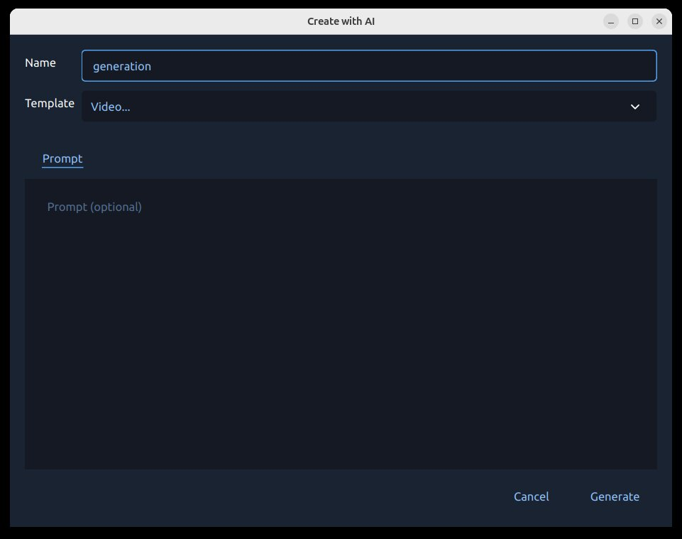
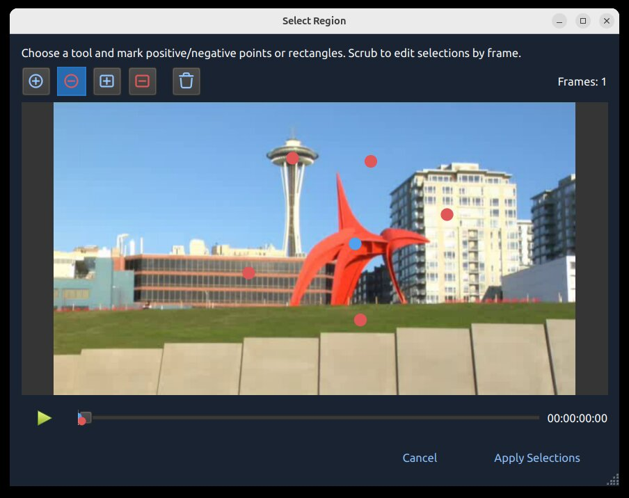
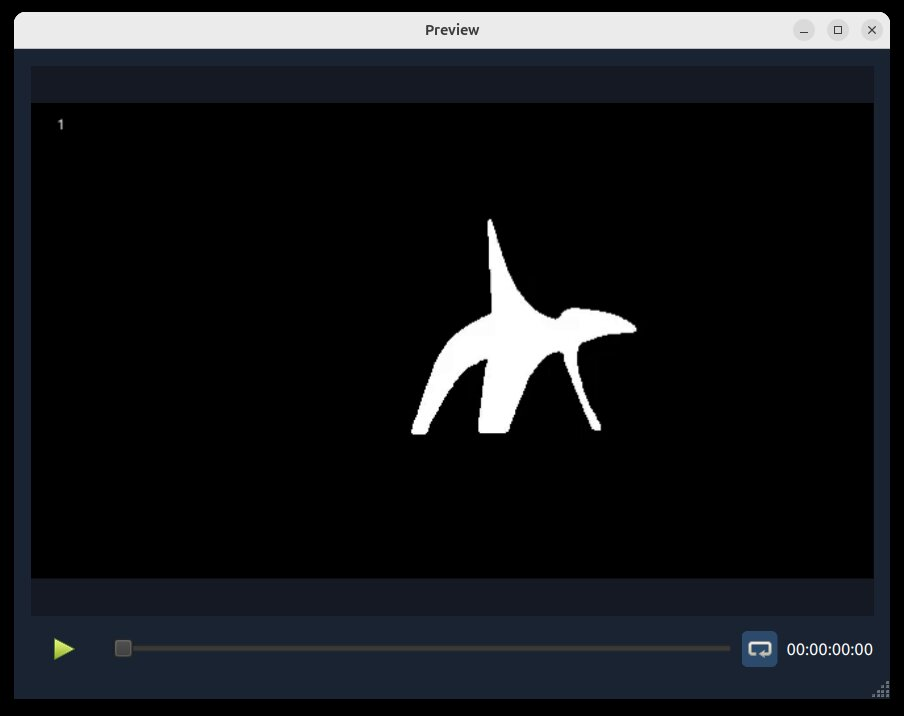

.. Copyright (c) 2008-2026 OpenShot Studios, LLC
 (http://www.openshotstudios.com). This file is part of
 OpenShot Video Editor (http://www.openshot.org), an open-source project
 dedicated to delivering high quality video editing and animation solutions
 to the world.

.. OpenShot Video Editor is free software: you can redistribute it and/or modify
 it under the terms of the GNU General Public License as published by
 the Free Software Foundation, either version 3 of the License, or
 (at your option) any later version.

.. OpenShot Video Editor is distributed in the hope that it will be useful,
 but WITHOUT ANY WARRANTY; without even the implied warranty of
 MERCHANTABILITY or FITNESS FOR A PARTICULAR PURPOSE.  See the
 GNU General Public License for more details.

.. You should have received a copy of the GNU General Public License
 along with OpenShot Library.  If not, see <http://www.gnu.org/licenses/>.

.. _ai_ref:

Advanced AI: ComfyUI
====================

OpenShot can connect to a local `ComfyUI <https://github.com/comfyanonymous/ComfyUI>`_ server and run AI workflows from the
Project Files and Timeline context menus. This page explains what these tools
are, what hardware they require, and where the built-in workflow templates live.

.. warning::
   AI features in OpenShot are **experimental** and require a **high-end workstation**.

   - These tools are **not recommended** for laptops, mid-range desktops, or budget systems.
   - You must run a local `ComfyUI <https://github.com/comfyanonymous/ComfyUI>`_ server.
   - You should expect model downloads, setup work, and workflow troubleshooting.

Minimum Recommended Hardware
----------------------------

.. table::
   :widths: 28 72

   ==========================  ==========================================================
   Component                   Recommendation
   ==========================  ==========================================================
   GPU                         NVIDIA 5070 12GB or better (16-24GB VRAM strongly preferred)
   CPU                         Ryzen 9 5900-class CPU (or equivalent high-clock multi-core)
   System memory               64GB RAM or more
   Storage                     200GB free space for models, cache, and generated outputs
   Experience                  Comfortable with ComfyUI graphs, models, and node dependencies
   ==========================  ==========================================================

If your system is below these levels, jobs will stall, fail, and produce unstable
results. If your GPU has 8GB or less of VRAM, you will run out of memory running these models.

Installation and Setup
----------------------

Use this quick setup path before trying any AI workflow in OpenShot:

1. Install ComfyUI and confirm it starts correctly.
2. Install required custom nodes (listed below).
3. Download required model files (listed below) into matching model folders.
4. Start ComfyUI, then open :guilabel:`Edit->Preferences->Advanced` and set :guilabel:`ComfyUI URL`.
5. Click :guilabel:`Check` to confirm OpenShot can reach the server.

For a full step-by-step server setup guide, see the OpenShot wiki:
`ComfyUI: Advanced AI Setup Guide <https://github.com/OpenShot/openshot-qt/wiki/ComfyUI:-Advanced-AI-Setup-Guide>`_.

For full ComfyUI installation details, see the official repository:
`ComfyUI on GitHub <https://github.com/comfyanonymous/ComfyUI>`_.

Required Custom Nodes
^^^^^^^^^^^^^^^^^^^^^

- `comfyui_controlnet_aux <https://github.com/Fannovel16/comfyui_controlnet_aux>`_
- `ComfyUI-Frame-Interpolation <https://github.com/Fannovel16/ComfyUI-Frame-Interpolation>`_
- `ComfyUI-VideoHelperSuite <https://github.com/Kosinkadink/ComfyUI-VideoHelperSuite>`_
- `ComfyUI-Video-Segmentation <https://github.com/miaoshouai/ComfyUI-Video-Segmentation>`_
- `ComfyUI-Whisper <https://github.com/yuvraj108c/ComfyUI-Whisper>`_
- `OpenShot-ComfyUI <https://github.com/OpenShot/OpenShot-ComfyUI>`_

Required Models / Files
^^^^^^^^^^^^^^^^^^^^^^^

- ``ComfyUI/models/diffusion_models/wan2.1_vace_1.3B_fp16.safetensors``
- ``ComfyUI/custom_nodes/ComfyUI-Frame-Interpolation/ckpts/rife/rife47.pth``
- ``ComfyUI/models/checkpoints/sd_xl_base_1.0.safetensors``
- ``ComfyUI/models/checkpoints/sd_xl_refiner_1.0.safetensors``
- ``ComfyUI/models/checkpoints/stable-audio-open-1.0.safetensors``
- ``ComfyUI/models/clip_vision/clip_vision_g.safetensors``
- ``ComfyUI/models/diffusion_models/wan2.2_ti2v_5B_fp16.safetensors``
- ``ComfyUI/models/grounding-dino/groundingdino_swint_ogc.pth``
- ``ComfyUI/models/sam2/sam2.1_hiera_base_plus.pt``
- ``ComfyUI/models/sam2/sam2.1_hiera_small-fp16.safetensors``
- ``ComfyUI/models/sam2/sam2.1_hiera_small.pt``
- ``ComfyUI/models/sam2/sam2.1_hiera_tiny-fp16.safetensors``
- ``ComfyUI/models/sam2/sam2.1_hiera_tiny.pt``
- ``ComfyUI/models/sam2/sam2_hiera_small.pt``
- ``ComfyUI/models/stt/whisper/large-v3.pt``
- ``ComfyUI/models/stt/whisper/medium.pt``
- ``ComfyUI/models/text_encoders/t5-base.safetensors``
- ``ComfyUI/models/text_encoders/umt5_xxl_fp8_e4m3fn_scaled.safetensors``
- ``ComfyUI/models/TTS/Ace-Step1.5/acestep-v15-turbo/silence_latent.pt``
- ``ComfyUI/models/upscale_models/RealESRGAN_x4plus.safetensors``
- ``ComfyUI/models/vae/wan_2.1_vae.safetensors``
- ``ComfyUI/models/vae/wan2.2_vae.safetensors``
- ``ComfyUI/models/VLM/transnetv2-pytorch-weights/transnetv2-pytorch-weights.pth``

What Users See in OpenShot
--------------------------

When ComfyUI is available, OpenShot shows AI tools in context menus:

- :guilabel:`Create with AI` for creating new assets

  .. image:: images/create-with-ai.jpg

- :guilabel:`Enhance with AI (images)` for processing image assets

  .. image:: images/enhance-with-ai-image.jpg

- :guilabel:`Enhance with AI (videos)` for processing video assets

  .. image:: images/enhance-with-ai-video.jpg

Generated files are added to :guilabel:`Project Files` with progress text and
queue badges. Outputs are saved under ``.openshot_qt/comfyui-output/``.

Starting a **new project** or opening an **existing project** clears the
temporary ``.openshot_qt`` AI working folders so you begin with a clean slate.
Your saved projects are not affected, and any assets previously copied into a
``PROJECTNAME_Assets`` folder remain in that project's directory.

If ComfyUI is unavailable, OpenShot disables the AI menus. Configure the server URL
in :guilabel:`Edit->Preferences->Advanced`, then use the
:guilabel:`Check` button to test connectivity.

Workflow Templates
------------------

OpenShot reads built-in templates from ``comfyui/``. It also loads custom
user templates from ``~/.openshot_qt/comfyui/``.

To add your own workflow:

1. In ComfyUI, open the workflow tab you want to use.
2. Choose :guilabel:`Export (API)` to save the workflow as a ``*.json`` file.
3. Copy that JSON file into ``~/.openshot_qt/comfyui/``.
4. Restart OpenShot, or reopen the project if needed.

OpenShot will automatically load the workflow and show it in the appropriate AI
menu. When you trigger it from OpenShot, the selected source file is passed into
the workflow, and the output from the workflow's final output node is imported
back into :guilabel:`Project Files`.

OpenShot also writes a ``.openshot_qt/comfyui/debug.json`` payload for advanced
users who want to inspect the exact request sent to ComfyUI.

AI Action Dialog
----------------

Both :guilabel:`Create with AI` and :guilabel:`Enhance with AI` open the same
generation dialog.

Why this dialog matters:

- It keeps all AI inputs in one place.
- It validates required fields before queuing the job.
- It lets you set up tracking prompts before expensive runs.

What you can do in the dialog:

- Choose the workflow/action.
- Enter the prompt text.
- Preview the selected source file (for enhance workflows).
- Set the output name for generated media.
- Pick a reference image in the :guilabel:`Reference` tab for workflows that require one.
- Provide tracking points/rectangles for tracking workflows.
- Start the job with :guilabel:`Generate` or close with :guilabel:`Cancel`.

Tracking (Mask, Blur, Highlight)
--------------------------------

Tracking workflows (:guilabel:`Blur...`, :guilabel:`Highlight...`,
:guilabel:`Mask...`) use a region screen where you mark what to include and
what to ignore.

Why this matters
^^^^^^^^^^^^^^^^

Tracking helps your effect stay attached to a moving subject over time.
For example, you can blur a face, highlight a player, or generate a clean mask
that follows the same object across many frames.

Tracking Icons
^^^^^^^^^^^^^^

.. list-table::
   :widths: 35 65
   :header-rows: 1

   * - Icon / Marker
     - Meaning
   * - Blue dot
     - Positive tracking coordinate (foreground/subject seed point).
   * - Red dot
     - Negative tracking coordinate (background/exclusion seed point).
   * - Blue rectangle
     - Positive region seed (broad subject hint).
   * - Red rectangle
     - Negative region seed (broad exclusion hint).
   * - Delete icon
     - Clear all current tracking seeds (points/rectangles) and start over.

How Tracking Works
^^^^^^^^^^^^^^^^^^

OpenShot sends your positive and negative markers as seed coordinates to the
tracking model, which builds a mask for the subject and then follows it over
time. Better seeds usually produce cleaner masks and less drift. [sam2]_

How to use it
^^^^^^^^^^^^^

1. Pick a frame where the subject is clearly visible.
2. Start with one blue dot on the subject.
3. Add red dots on nearby background only if needed.
4. Add rectangles when you need faster broad selection.
5. Repeat on additional frames when motion/shape changes.

Adjusting over time (frame slider):

- Move the frame slider to different moments in the clip.
- Add or adjust dots/rectangles on frames where tracking starts to drift.
- Use additional seed points only where needed, especially on occlusions, fast motion, or major shape changes.

**Mask Preview Output (from this tracking process):**

Best Practices
^^^^^^^^^^^^^^

- Use a short test clip first.
- Start simple: a single blue dot is often enough.
- Add more points only where tracking fails.
- If needed, add a more nuanced set of positive/negative points and rectangles.
- Keep positive and negative points separated clearly.
- If tracking becomes messy, use the Delete icon and restart with cleaner seeds.

.. [sam2] *SAM2 (Segment Anything Model 2) project:* `facebookresearch/sam2 <https://github.com/facebookresearch/sam2>`_

Job Queue, Progress, and Cancel
-------------------------------

After you click :guilabel:`Generate`, the request is queued and runs in
OpenShot's AI job queue.

- Progress is shown in :guilabel:`Project Files` (badges and status text).
- Completed outputs are imported back into :guilabel:`Project Files`.
- Active jobs can be canceled by right-clicking the generated project file with the progress bar and choosing :guilabel:`Cancel Job`.
- Outputs are written under ``.openshot_qt/comfyui-output/``.

Built-in JSON Workflows
-----------------------

The sections below map directly to built-in JSON templates in ``comfyui/``.
Each subsection describes why you might use it, how to run it, and key details.

Create with AI
^^^^^^^^^^^^^^

Image... (``txt2img-basic``)
""""""""""""""""""""""""""""

- Why: Generate still images from a text prompt.
- How: Choose :guilabel:`Create with AI` -> :guilabel:`Image...`, enter a prompt, then generate.
- Details: Uses ``comfyui/txt2img-basic.json`` with ``sd_xl_base_1.0.safetensors``.

Video... (``txt2video-svd``)
""""""""""""""""""""""""""""

- Why: Generate short video clips from text.
- How: Choose :guilabel:`Create with AI` -> :guilabel:`Video...`, enter a prompt, then generate.
- Details: Uses ``comfyui/txt2video-svd.json`` with WAN video generation models.

Sound... (``txt2audio-stable-open``)
""""""""""""""""""""""""""""""""""""

- Why: Generate non-musical audio from text prompts.
- How: Choose :guilabel:`Create with AI` -> :guilabel:`Sound...`, enter a prompt, then generate.
- Details: Uses ``comfyui/txt2audio-stable-open.json`` with Stable Audio Open models.

Music... (``txt2music-ace-step``)
"""""""""""""""""""""""""""""""""

- Why: Generate music from style/tags (and optional lyrics).
- How: Choose :guilabel:`Create with AI` -> :guilabel:`Music...`, enter prompt text, then generate.
- Details: Uses ``comfyui/txt2music-ace-step.json`` with an Ace-Step 1.5 checkpoint.

Enhance with AI
^^^^^^^^^^^^^^^

Change Image Style... (``img2img-basic``)
""""""""""""""""""""""""""""""""""""""""""

- Why: Restyle an existing image while keeping the source composition.
- How: Choose :guilabel:`Enhance with AI` on an image, enter a style prompt, then generate.
- Details: Uses ``comfyui/img2img-basic.json`` with ``sd_xl_base_1.0.safetensors``.

Depth (``image-extract-depth``)
"""""""""""""""""""""""""""""""""""

- Why: Export a grayscale depth-map image from a source image.
- How: Choose :guilabel:`Enhance with AI` -> :guilabel:`Extract` -> :guilabel:`Depth` on an image, then generate.
- Details: Uses ``comfyui/image-extract-depth.json`` with ``DepthAnythingV2Preprocessor``.

Lines (``image-extract-lines``)
""""""""""""""""""""""""""""""""""

- Why: Export a line-map image from a source image.
- How: Choose :guilabel:`Enhance with AI` -> :guilabel:`Extract` -> :guilabel:`Lines` on an image, then generate.
- Details: Uses ``comfyui/image-extract-lines.json`` with ``LineArtPreprocessor``.

Image to Video... (``img2video-wan``)
"""""""""""""""""""""""""""""""""""""

- Why: Turn a still image into a generated video shot.
- How: Choose :guilabel:`Enhance with AI` on an image, provide prompt guidance, then generate.
- Details: Uses ``comfyui/img2video-wan.json`` with WAN 2.2 image-to-video models.

Change Video Style... (``video2video-basic``)
""""""""""""""""""""""""""""""""""""""""""""""

- Why: Apply a new visual style to a source video.
- How: Choose :guilabel:`Enhance with AI` on a video, enter a style prompt, pick a reference image in the :guilabel:`Reference` tab, then generate.
- Details: Uses ``comfyui/video2video-basic.json`` with WAN VACE video-to-video nodes, a required reference image, blended ``DepthAnythingV2Preprocessor`` depth plus Canny edge control, and the ``wan2.1_vace_1.3B_fp16.safetensors``, ``wan_2.1_vae.safetensors``, and ``umt5_xxl_fp8_e4m3fn_scaled.safetensors`` models.

Depth (``video-extract-depth``)
"""""""""""""""""""""""""""""""""""

- Why: Export a grayscale depth-map version of a source video.
- How: Choose :guilabel:`Enhance with AI` -> :guilabel:`Extract` -> :guilabel:`Depth` on a video, then generate.
- Details: Uses ``comfyui/video-extract-depth.json`` with ``DepthAnythingV2Preprocessor`` and preserves the source frame rate.

Lines (``video-extract-lines``)
""""""""""""""""""""""""""""""""""

- Why: Export a line-map version of a source video.
- How: Choose :guilabel:`Enhance with AI` -> :guilabel:`Extract` -> :guilabel:`Lines` on a video, then generate.
- Details: Uses ``comfyui/video-extract-lines.json`` with ``LineArtPreprocessor`` and preserves the source frame rate.

Increase Resolution (image) (``upscale-realesrgan-x4``)
""""""""""""""""""""""""""""""""""""""""""""""""""""""""

- Why: Upscale low-resolution images.
- How: Choose :guilabel:`Enhance with AI` on an image, select increase resolution, then generate.
- Details: Uses ``comfyui/upscale-realesrgan-x4.json`` with ``RealESRGAN_x4plus.safetensors``.

Increase Resolution (video) (``video-upscale-gan``)
""""""""""""""""""""""""""""""""""""""""""""""""""""

- Why: Upscale video frames for higher apparent detail.
- How: Choose :guilabel:`Enhance with AI` on a video, select increase resolution, then generate.
- Details: Uses ``comfyui/video-upscale-gan.json`` with ``RealESRGAN_x4plus.safetensors``.

Smooth Motion (2x Frame Rate) (``video-frame-interpolation-rife2x``)
"""""""""""""""""""""""""""""""""""""""""""""""""""""""""""""""""""""

- Why: Increase frame rate for smoother perceived motion.
- How: Choose :guilabel:`Enhance with AI` on a video, select smooth motion, then generate.
- Details: Uses ``comfyui/video-frame-interpolation-rife2x.json`` with ``rife47.pth``.

Split into Scenes (``video-segment-scenes-transnet``)
""""""""""""""""""""""""""""""""""""""""""""""""""""""

- Why: Automatically detect scene changes and split long clips into segments.
- How: Choose :guilabel:`Enhance with AI` on a video, select scene splitting, then generate.
- Details: Uses ``comfyui/video-segment-scenes-transnet.json`` with TransNetV2.

Add Captions from Speech (``video-whisper-srt``)
"""""""""""""""""""""""""""""""""""""""""""""""""

- Why: Transcribe speech into subtitle/caption files.
- How: Choose :guilabel:`Enhance with AI` on a video, select captions, then generate.
- Details: Uses ``comfyui/video-whisper-srt.json`` and creates SRT output.

Tracking Workflows (SAM2)
^^^^^^^^^^^^^^^^^^^^^^^^^

These workflows use the same region/tracking input flow and are grouped in the
tracking context menu.

Blur... (image) (``image-blur-anything-sam2``)
""""""""""""""""""""""""""""""""""""""""""""""

- Why: Blur selected subject areas in a still image.
- How: Select points/rectangles for the subject, then generate.
- Details: Uses ``comfyui/image-blur-anything-sam2.json`` with SAM2 image segmentation.

Highlight... (image) (``image-highlight-anything-sam2``)
""""""""""""""""""""""""""""""""""""""""""""""""""""""""

- Why: Emphasize selected subject areas in a still image.
- How: Select points/rectangles for the subject, then generate.
- Details: Uses ``comfyui/image-highlight-anything-sam2.json`` with SAM2 image segmentation.

Mask... (image) (``image-mask-anything-sam2``)
""""""""""""""""""""""""""""""""""""""""""""""

- Why: Generate an image mask for selected subject areas.
- How: Select points/rectangles for the subject, then generate.
- Details: Uses ``comfyui/image-mask-anything-sam2.json`` with SAM2 image segmentation.

Blur... (video) (``video-blur-anything-sam2``)
""""""""""""""""""""""""""""""""""""""""""""""

- Why: Track and blur a moving subject in video.
- How: Mark subject/background in the region screen, then generate.
- Details: Uses ``comfyui/video-blur-anything-sam2.json`` with SAM2 video tracking.

Highlight... (video) (``video-highlight-anything-sam2``)
""""""""""""""""""""""""""""""""""""""""""""""""""""""""

- Why: Track and highlight a moving subject in video.
- How: Mark subject/background in the region screen, then generate.
- Details: Uses ``comfyui/video-highlight-anything-sam2.json`` with SAM2 video tracking.

Mask... (video) (``video-mask-anything-sam2``)
""""""""""""""""""""""""""""""""""""""""""""""

- Why: Generate an animated mask that follows a moving subject.
- How: Mark subject/background in the region screen, then generate.
- Details: Uses ``comfyui/video-mask-anything-sam2.json`` with SAM2 video tracking.

Starting Points for New Users
-----------------------------

If you are new to these tools, start with:

1. :guilabel:`Create with AI` -> :guilabel:`Image`
2. :guilabel:`Enhance with AI` -> :guilabel:`Increase Resolution`
3. :guilabel:`Enhance with AI` -> :guilabel:`Smooth Motion`
4. :guilabel:`Enhance with AI` -> :guilabel:`Split into Scenes`
5. :guilabel:`Enhance with AI` -> :guilabel:`Add Captions`

Troubleshooting
---------------

If AI menus do not appear or jobs fail immediately:

1. Verify ComfyUI is running and reachable at the configured URL.
2. Confirm required models exist in your ComfyUI environment.
3. Confirm custom node packages are installed for the workflow you selected.
4. Reduce batch/chunk sizes for long clips.
5. Re-test with a short clip or still image first.

For general performance and cache tuning, see :ref:`preferences_ref` and
:ref:`playback_ref`.
