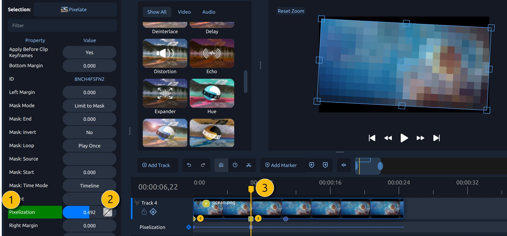
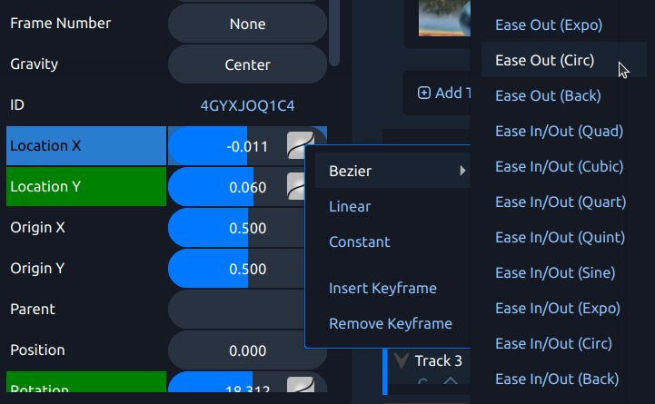
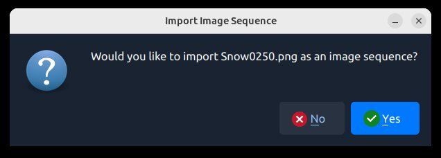

.. Copyright (c) 2008-2016 OpenShot Studios, LLC
 (http://www.openshotstudios.com). This file is part of
 OpenShot Video Editor (http://www.openshot.org), an open-source project
 dedicated to delivering high quality video editing and animation solutions
 to the world.

.. OpenShot Video Editor is free software: you can redistribute it and/or modify
 it under the terms of the GNU General Public License as published by
 the Free Software Foundation, either version 3 of the License, or
 (at your option) any later version.

.. OpenShot Video Editor is distributed in the hope that it will be useful,
 but WITHOUT ANY WARRANTY; without even the implied warranty of
 MERCHANTABILITY or FITNESS FOR A PARTICULAR PURPOSE.  See the
 GNU General Public License for more details.

.. You should have received a copy of the GNU General Public License
 along with OpenShot Library.  If not, see <http://www.gnu.org/licenses/>.

.. _animation_ref:

Animation
=========

OpenShot has been designed specifically with animation in mind. The powerful curve-based animation framework can
handle most jobs with ease, and is flexible enough to create just about any animation. Key frames specify
values at certain points on a clip, and OpenShot does the hard work of interpolating the in-between values.

Overview
--------

.. table::
   :widths: 5 20 60

   ==  ==================  ============
   #   Name                Description
   ==  ==================  ============
   1   Green Property      When the play-head is on a key frame, the property appears green
   1   Blue Property       When the play-head is on an interpolated value, the property appears blue
   2   Value Slider        Click and drag your mouse to adjust the value (this automatically creates a key frame if needed)
   3   Play-head           Position the play-head over a clip where you need a key frame
   4   Key frame Markers   Colorful icons line the bottom of the clip for every keyframe (`circle=Bézier`, `diamond=linear`, `square=constant`). Each icon matches the color of its clip, effect, or transition. The selected item's keyframe icons are shown brighter. Filtering the property list also filters these icons. Click any icon to jump the play-head, load its properties, and select its clip, effect, or transition. Drag an icon left or right to move the keyframe and fine‑tune your animation timing.
   ==  ==================  ============

Key Frames
----------
To create a key frame in OpenShot, simply position the play-head (i.e. playback position) at any point over a clip,
and edit properties in the property dialog. If the property supports key frames, it will turn green, and a small icon
(`circle=Bézier, diamond=linear, square=constant`) will appear on the bottom of your clip at that position. Move your
play-head to another point over that clip, and adjust the properties again. All animations require at least 2 key
frames, but can support an unlimited number of them.

Use the :guilabel:`Next Marker` and :guilabel:`Previous Marker` toolbar buttons to step through the selected item's
keyframes. They follow whichever clip, effect, or transition is selected. When an effect is selected, navigation also
stops at the start and end of its parent clip.

To adjust the **interpolation mode**, right click on the small graph icon next to a property value.

.. table::
   :widths: 20 80

   ========================  ============
   Key-frame Interpolation    Description
   ========================  ============
   Bézier                    Interpolated values use a quadratic curve, and ease-in and ease-out. Icon: :guilabel:`Circle`.
   Linear                    Interpolated values are calculated linear (each step value is equal). Icon: :guilabel:`Diamond`.
   Constant                  Interpolated values stay the same until the next key frame, and jump to the new value. Icon: :guilabel:`Square`.
   ========================  ============

| For more info on creating key frames for location, rotation, scale, shear, and origin, see :ref:`clip_transform_ref`.
| For more info on preset animations, see :ref:`clip_presets_ref`.
| For a full list of key frames, see :ref:`clip_properties_ref`.

Timing
------
Changing how fast a clip plays is done with the :guilabel:`Time` property and the :guilabel:`Timing` tool.

- The :guilabel:`Time` menu offers presets such as normal, fast, slow, freeze, and reverse. See details in :ref:`clip_time_ref`.
- The :guilabel:`Timing` tool lets you drag a clip’s edges to speed it up or slow it down. OpenShot adds the needed Time keyframes
  and **scales your other keyframes** so your animations stay aligned. Shorter clips play faster, longer clips play slower.
  See more: :ref:`clip_time_ref`.

Repeating
---------
To play a clip multiple times, use :guilabel:`Right-Click → Time → Repeat`.

- :guilabel:`Loop` repeats in one direction (forward or reverse).
- :guilabel:`Ping-Pong` alternates direction (forward then backward, etc.).
- :guilabel:`Custom` can add a short pause between passes, speed up or slow down each pass, including keyframes.

OpenShot writes the :guilabel:`Time` curve for you, and you can edit those keyframes just like any other.
See more: :ref:`clip_time_repeat_ref`.

Bézier Presets
--------------
When using a Bézier curve for animation, OpenShot includes more than 20 curve presets (which affect the shape
of the curve). For example, **Ease-In** has a more gradual slope at the beginning, making an animation move slower at
the beginning, and faster at the end. **Ease-In/Out (Back)** has a gradual beginning and ending, but actually goes past
the expected value and then back (producing a bounce effect).

To choose a curve preset, right click on the small graph icon next to a key frame.

.. _animation_image_seq_ref:

Image Sequences
---------------
If you have a sequence of similarly named images (such as, cat001.png, cat002.png, cat003.png, etc...), you can simply
drag and drop one of them into OpenShot, and you will be prompted to import the entire sequence. OpenShot will playback
these sequential images rapidly, as if they are frames in a video. The rate or speed in which these images are displayed
is based on their frame rate.

**NOTE:** Be sure your image sequence starts at 0 or 1, or you will likely receive an error when importing it into OpenShot.
For example, if your sequence starts at cat222.png, or has missing images in the sequence, OpenShot will
struggle to understand the sequence. An easy work-around is to renumber the images so they start with 1.

To adjust the frame rate of the animation, right click and choose **File Properties** in the **Project Files** panel,
and adjust the frame rate. Once you have set the correct frame rate, drag the animation onto the timeline.

.. image:: images/file-properties.jpg

.. table::
   :widths: 5 20 80

   ==  ====================  ============
   #   Name                  Description
   ==  ====================  ============
   1   File Properties       Select an image sequence in the **Project Files** panel, right click and choose **File Properties**
   2   Frame Rate            Adjust the frame rate of the animation. Typically, hand-drawn animations use 12 frames per second.
   ==  ====================  ============

