.. Copyright (c) 2008-2016 OpenShot Studios, LLC
 (http://www.openshotstudios.com). This file is part of
 OpenShot Video Editor (http://www.openshot.org), an open-source project
 dedicated to delivering high quality video editing and animation solutions
 to the world.

.. OpenShot Video Editor is free software: you can redistribute it and/or modify
 it under the terms of the GNU General Public License as published by
 the Free Software Foundation, either version 3 of the License, or
 (at your option) any later version.

.. OpenShot Video Editor is distributed in the hope that it will be useful,
 but WITHOUT ANY WARRANTY; without even the implied warranty of
 MERCHANTABILITY or FITNESS FOR A PARTICULAR PURPOSE.  See the
 GNU General Public License for more details.

.. You should have received a copy of the GNU General Public License
 along with OpenShot Library.  If not, see <http://www.gnu.org/licenses/>.

.. _effects_ref:

Effects
=======

Effects are used in OpenShot to enhance or modify the audio or video of a clip. They can modify pixels and audio data,
and can generally enhance your video projects. Each effect has its own set of properties, most of which can be animated
over time, for example varying the :guilabel:`Brightness & Contrast` of a clip over time.

Effects can be added to any clip by dragging and dropping them from the Effects tab onto a clip. Each effect is
represented by a small colored icon and the first letter of the effect name. Note: Pay close attention to where the play-head
(i.e. red playback line) is. Key frames are automatically created at the current playback position,
to help create animations quickly.

To view an effect's properties, right-click on the effect icon, revealing the context menu, and choose :guilabel:`Properties`.
The property editor will appear, where you can edit these properties. Properties appear alphabetically in the dock,
with filter options available at the top. Hold :kbd:`Ctrl` and click multiple
effect icons to select them all, the Properties dock will show an entry such as
``3 Selections`` so you can adjust their common settings in one step. See :ref:`clip_properties_ref`.

Masks and Effects
-----------------

All effects can now use a **static or animated mask** to limit where the effect
is applied. This makes effects much more precise, because you can target only
the subject or region you care about and blend the result smoothly into the
original image.

Why this matters:

- Keep edits focused on one area (for example, blur only a face).
- Stack multiple effects on the same subject without affecting the full frame.
- Animate how strongly or where an effect is applied over time.

How to use effect masks:

1. Add an effect to a clip.
2. Open the effect :guilabel:`Properties`.
3. Choose a mask source (static image or animated mask video).
4. Adjust :guilabel:`Mask Mode` (for example, *Limit to Mask* or *Vary Strength*).

High-quality animated masks can also be generated with Advanced AI workflows.
In many cases, you can click one or more subjects and let tracking build a mask
automatically. See :ref:`ai_ref`.

Mask controls to know:

- Any effect mask can be inverted to flip between foreground and background.
- Animated mask videos can be looped.
- When looping, set start/end mask trim carefully. If not adjusted, OpenShot
  loops the entire mask source, not just the segment you intended to repeat.

To adjust a property:

- Drag the slider for coarse changes.
- Double-click to enter precise values.
- Right/double-click for non-numerical options.

Effect properties are integral to the :ref:`animation_ref` system. When you modify an effect property, a
keyframe is generated at the current playhead position. For a property to span the entire clip,
position the playhead at or before the clip's start before making adjustments. A convenient way to
identify a clip's start is by utilizing the 'next/previous marker' feature on the Timeline toolbar.

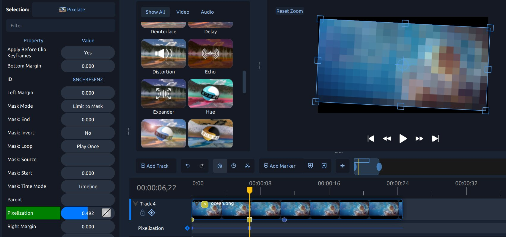

List of Effects
---------------
OpenShot Video Editor has a total of 27 built-in video and audio effects: 18 video effects and 9 audio effects.
These effects can be added to a clip by dragging the effect onto a clip. The following table contains
the name and short description of each effect.

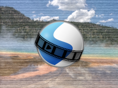

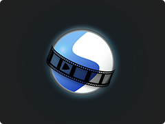

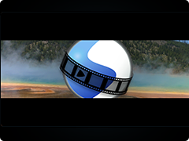

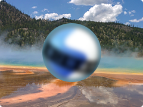

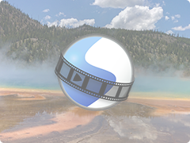

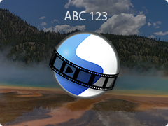

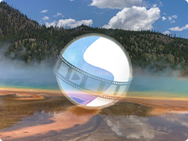

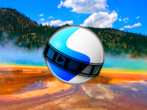

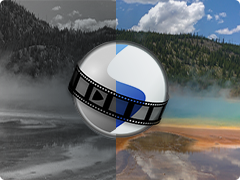

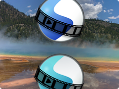

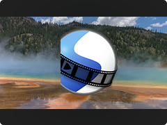

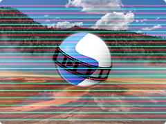

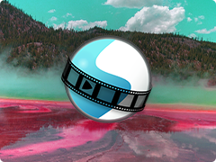

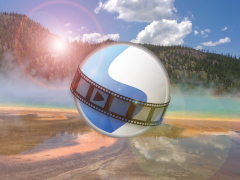

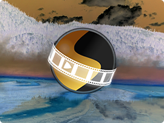

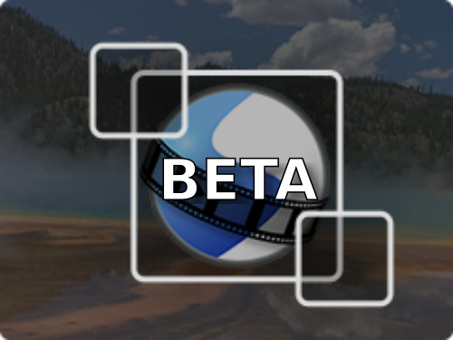

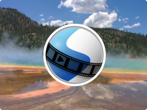

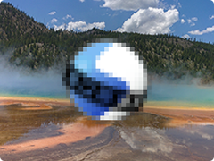

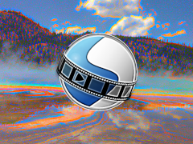

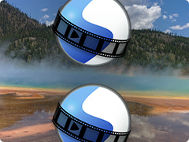

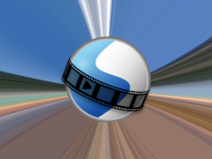

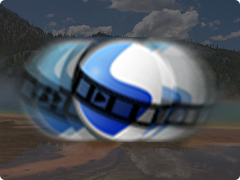

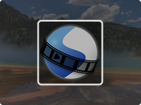

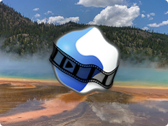

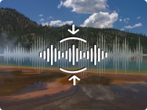

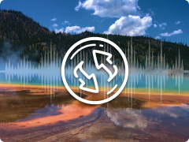

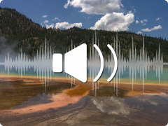

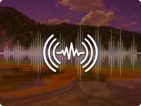

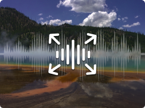

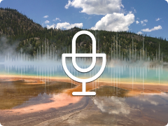

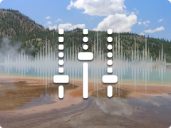

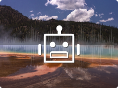

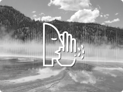

.. table::
   :widths: 15 30 80

   =========================== ============================= ===============
   Icon                        Effect Name                   Effect Description
   =========================== ============================= ===============
   |analogtape_icon|           Analog Tape                   Vintage home-video wobble, bleed, and snow.
   |mask_icon|                 Alpha Mask / Wipe Transition  Grayscale mask transition between images.
   |bars_icon|                 Bars                          Add colored bars around your video.
   |blur_icon|                 Blur                          Adjust image blur.
   |brightness_icon|           Brightness & Contrast         Modify frame’s brightness and contrast.
   |caption_icon|              Caption                       Add text captions to any clip.
   |chromakey_icon|            Chroma Key (Greenscreen)      Replace color with transparency.
   |colormap_icon|             Color Map / Lookup            Adjust colors using 3D LUT lookup tables (.cube format).
   |saturation_icon|           Color Saturation              Adjust color intensity.
   |colorshift_icon|           Color Shift                   Shift image colors in various directions.
   |crop_icon|                 Crop                          Crop out parts of your video.
   |deinterlace_icon|          Deinterlace                   Remove interlacing from video.
   |hue_icon|                  Hue                           Adjust hue / color.
   |lensflare_icon|            Lens Flare                    Simulate sunlight hitting a lens with flares.
   |negate_icon|               Negative                      Produce a negative image.
   |objectdetection_icon|      Object Detector               Detect objects in video.
   |outline_icon|              Outline                       Add outline around any image or text.
   |pixelate_icon|             Pixelate                      Increase or decrease visible pixels.
   |sharpen_icon|              Sharpen                       Boost edge contrast to make video details look crisper.
   |shift_icon|                Shift                         Shift image in different directions.
   |sphericalprojection_icon|  Spherical Projection          Flatten or project 360° and fisheye footage.
   |stabilizer_icon|           Stabilizer                    Reduce video shake.
   |tracker_icon|              Tracker                       Track bounding box in video.
   |wave_icon|                 Wave                          Distort image into a wave pattern.
   |compressor_icon|           Compressor                    Reduce loudness or amplify quiet sounds.
   |delay_icon|                Delay                         Adjust audio-video synchronism.
   |distortion_icon|           Distortion                    Clip audio signal for distortion.
   |echo_icon|                 Echo                          Add delayed sound reflection.
   |expander_icon|             Expander                      Make loud parts relatively louder.
   |noise_icon|                Noise                         Add random equal-intensity signals.
   |parametriceq_icon|         Parametric EQ                 Adjust frequency volume in audio.
   |robotization_icon|         Robotization                  Transform audio into robotic voice.
   |whisperization_icon|       Whisperization                Transform audio into whispers.
   =========================== ============================= ===============

Effect Properties
-----------------
Below is a list of **common** effect properties, shared by all effects in OpenShot. To view an effect's properties,
right click and choose :guilabel:`Properties`. The property editor will appear, where you can change these properties. Note: Pay
close attention to where the play-head (i.e. red playback line) is. Key frames are automatically created at the current playback
position, to help quickly create animations.

See the table below for a list of common effect properties. Only the **common properties** that all effects share are listed here.
Each effect also has many **unique properties**, which are specific to each effect, see :ref:`effect_video_effects_ref` for
more information on individual effects and their unique properties.

.. table::
   :widths: 18 18 70

   ======================  ==========  ============
   Effect Property Name    Type        Description
   ======================  ==========  ============
   Duration                Float       The length of the effect (in seconds). Read-only property. Most effects default to the length of a clip. This property is hidden when an effect belongs to a clip.
   End                     Float       The end trimming position of the effect (in seconds). This property is hidden when an effect belongs to a clip.
   ID                      String      A randomly generated GUID (globally unique identifier) assigned to each effect. Read-only property.
   Parent                  String      The parent object to this effect, which makes many of these keyframe values initialize to the parent value.
   Position                Float       The position of the effect on the timeline (in seconds). This property is hidden when an effect belongs to a clip.
   Start                   Float       The start trimming position of the effect (in seconds). This property is hidden when an effect belongs to a clip.
   Track                   Int         The layer which holds the effect (higher tracks are rendered on top of lower tracks). This property is hidden when an effect belongs to a clip.
   Apply Before Clip       Boolean     Apply this effect before the Clip processes keyframes? (default is Yes)
   ======================  ==========  ============

Duration
""""""""
The :guilabel:`Duration` property is a float value indicating the length of the effect in seconds. This is a Read-only property.
This is calculated by: End - Start. To modify duration, you must edit the :guilabel:`Start` and/or :guilabel:`End` effect properties.

*NOTE: Most effects in OpenShot default the effect duration to the clip duration, and hide this property from the editor.*

End
"""
The :guilabel:`End` property defines the trimming point at the end of the effect in seconds, allowing you to control how much
of the effect is visible in the timeline. Changing this property will impact the :guilabel:`Duration` effect property.

*NOTE: Most effects in OpenShot default this property to match the clip, and hide this property from the editor.*

ID
""
The :guilabel:`ID` property holds a randomly generated GUID (Globally Unique Identifier) assigned to each effect,
ensuring its uniqueness. This is a Read-only property, and assigned by OpenShot when an effect is created.

Track
"""""
The :guilabel:`Track` property is an integer indicating the layer on which the effect is placed. Effects on higher tracks are rendered
above those on lower tracks.

*NOTE: Most effects in OpenShot default this property to match the clip, and hide this property from the editor.*

.. _effect_parent_ref:

Effect Parent
-------------
The :guilabel:`Parent` property of an effect sets the initial keyframe values to a parent effect. For example, if many effects all point to the
same parent effect, they will inherit all their initial properties, such as font size, font color, and background color for a ``Caption`` effect.
In the example of many ``Caption`` effects using the same Parent effect, it is an efficient way to manage a large number of these effects.

NOTE: The ``parent`` property for effects should be linked to the **same type** of parent effect, otherwise their default initial values
will not match. Also see :ref:`clip_parent_ref`.

Position
""""""""
The :guilabel:`Position` property determines the effect's position on the timeline in seconds, with 0.0 indicating the beginning.

*NOTE: Most effects in OpenShot default this property to match the clip, and hide this property from the editor.*

Start
"""""
The :guilabel:`Start` property defines the trimming point at the beginning of the effect in seconds.
Changing this property will impact the :guilabel:`Duration` effect property.

*NOTE: Most effects in OpenShot default this property to match the clip, and hide this property from the editor.*

Sequencing
----------

Effects are normally applied **before** the Clip processes keyframes. This allows the effect to process the raw image of
the clip, before the clip applies properties such as scaling, rotation, location, etc... Normally, this is the preferred
sequence of events, and this is the default behavior of effects in OpenShot. However, you can optionally override this
behavior with the ``Apply Before Clip Keyframes`` property.

If you set the ``Apply Before Clip Keyframes`` property to ``No``, the effect will be sequenced **after** the clip scales, rotates,
and applies keyframes to the image. This can be useful on certain effects, such as the **Mask** effect, when you want
to animate a clip first and then apply a static mask to the clip.

.. _effect_video_effects_ref:

Video Effects
-------------

Effects are generally divided into two categories: video and audio effects. Video effects modify the image and pixel
data of a clip. Below is a list of video effects, and their properties. Often it is best to experiment with an effect,
entering different values into the properties, and observing the results.

Analog Tape
"""""""""""
The **Analog Tape** effect emulates consumer tape playback: horizontal line wobble ("tracking"), chroma bleed, luma softness, grainy snow, a bottom **tracking stripe**, and short **static bursts**.
All controls are key-framable and the noise is deterministic (seeded from the effect’s ID with an optional offset), so renders are repeatable.

.. table::
    :widths: 26 80

    ========================= ===========================================
    Property Name             Description
    ========================= ===========================================
    tracking                  ``(float, 0–1)`` Horizontal **line wobble** plus a subtle bottom **skew**. Higher values increase amplitude and skew height.
    bleed                     ``(float, 0–1)`` **Chroma bleed / fringing.** Horizontal chroma shift + blur with a slight desaturation. Gives the “rainbow edge” look.
    softness                  ``(float, 0–1)`` **Luma softness.** Small horizontal blur on Y (approx. 0–2 px). Keep low to retain detail when noise is high.
    noise                     ``(float, 0–1)`` **Snow, hiss, and dropouts.** Controls grain strength, probability/length of white **streaks**, and a faint line hum.
    stripe                    ``(float, 0–1)`` **Tracking stripe.** Lifts the bottom band, adds hiss/noise there, and widens the lifted region as the value increases.
    static_bands              ``(float, 0–1)`` **Static bursts.** Short bright bands with **row-clumped streaks** (many “shooting stars” across neighboring rows).
    seed_offset               ``(int, 0–1000)`` Adds to the internal seed (derived from the effect ID) for deterministic variation between clips.
    ========================= ===========================================

**Usage notes**

- **Subtle “home video”**: ``tracking=0.25``, ``bleed=0.20``, ``softness=0.20``, ``noise=0.25``, ``stripe=0.10``, ``static_bands=0.05``.
- **Bad tracking / head clog**: ``tracking=0.8–1.0``, ``stripe=0.6–0.9``, ``noise=0.6–0.8``, ``static_bands=0.4–0.6``, ``softness<=0.2``, and set ``bleed`` to about 0.3.
- **Color fringing only**: raise ``bleed`` (about 0.5) and keep other controls low.
- **Different but repeatable snow**: leave the effect ID alone (for deterministic output) and change ``seed_offset`` to get a new, still-repeatable pattern.

Alpha Mask / Wipe Transition
""""""""""""""""""""""""""""
The Alpha Mask / Wipe Transition effect leverages a grayscale mask to create a dynamic transition between two images
or video clips. In this effect, the light areas of the mask reveal the new image, while the dark areas conceal it,
allowing for creative and custom transitions that go beyond standard fade or wipe techniques. This effect only
affects the image, and not the audio track.

.. table::
   :widths: 26 80

   ==========================  ============
   Property Name               Description
   ==========================  ============
   brightness                  ``(float, -1 to 1)`` This curve controls the motion across the wipe
   contrast                    ``(float, 0 to 20)`` This curve controls the hardness and softness of the wipe edge
   reader                      ``(reader)`` This reader can use any image or video as input for your grayscale wipe
   replace_image               ``(bool, choices: ['Yes', 'No'])`` Replace the clips image with the current grayscale wipe image, useful for troubleshooting
   ==========================  ============

Bars
""""
The Bars effect adds colored bars around your video frame, which can be used for aesthetic purposes, to frame
the video within a certain aspect ratio, or to simulate the appearance of viewing content on a different display
device. This effect is particularly useful for creating a cinematic or broadcast look.

.. table::
   :widths: 26 80

   ==========================  ============
   Property Name               Description
   ==========================  ============
   bottom                      ``(float, 0 to 0.5)`` The curve to adjust the bottom bar size
   color                       ``(color)`` The curve to adjust the color of bars
   left                        ``(float, 0 to 0.5)`` The curve to adjust the left bar size
   right                       ``(float, 0 to 0.5)`` The curve to adjust the right bar size
   top                         ``(float, 0 to 0.5)`` The curve to adjust the top bar size
   ==========================  ============

Blur
""""
The Blur effect softens the image, reducing detail and texture. This can be used to create a sense of depth,
draw attention to specific parts of the frame, or simply to apply a stylistic choice for aesthetic purposes.
The intensity of the blur can be adjusted to achieve the desired level of softness.

.. table::
   :widths: 26 80

   ==========================  ============
   Property Name               Description
   ==========================  ============
   horizontal_radius           ``(float, 0 to 100)`` Horizontal blur radius keyframe. The size of the horizontal blur operation in pixels.
   iterations                  ``(float, 0 to 100)`` Iterations keyframe. The # of blur iterations per pixel. 3 iterations = Gaussian.
   sigma                       ``(float, 0 to 100)`` Sigma keyframe. The amount of spread in the blur operation. Should be larger than radius.
   vertical_radius             ``(float, 0 to 100)`` Vertical blur radius keyframe. The size of the vertical blur operation in pixels.
   ==========================  ============

Brightness & Contrast
"""""""""""""""""""""
The Brightness & Contrast effect allows for the adjustment of the overall lightness or darkness of the image
(brightness) and the difference between the darkest and lightest parts of the image (contrast). This effect can be
used to correct poorly lit videos or to create dramatic lighting effects for artistic purposes.

.. table::
   :widths: 26 80

   ==========================  ============
   Property Name               Description
   ==========================  ============
   brightness                  ``(float, -1 to 1)`` The curve to adjust the brightness
   contrast                    ``(float, 0 to 100)`` The curve to adjust the contrast (3 is typical, 20 is a lot, 100 is max. 0 is invalid)
   ==========================  ============

.. _caption_effect_ref:

Caption
"""""""
Add text captions on top of your video. We support both VTT (WebVTT) and SubRip (SRT) subtitle file formats. These
formats are used to display captions or subtitles in videos. They allow you to add text-based subtitles to video content,
making it more accessible to a wider audience, especially for those who are deaf or hard of hearing. The Caption
effect can even animate the text fading in/out, and supports any font, size, color, and margin. OpenShot also has an
easy-to-use Caption editor, where you can quickly insert captions at the playhead position, or edit all your caption
text in one place.

.. code-block:: console

   :caption: Show a caption, starting at 5 seconds and ending at 10 seconds.

   00:00:05.000 --> 00:00:10.000
   Hello, welcome to our video!

.. table::
   :widths: 26 80

   ==========================  ============
   Property Name               Description
   ==========================  ============
   background                  ``(color)`` Color of caption area background
   background_alpha            ``(float, 0 to 1)`` Background color alpha
   background_corner           ``(float, 0 to 60)`` Background corner radius
   background_padding          ``(float, 0 to 60)`` Background padding
   caption_font                ``(font)`` Font name or family name
   caption_text                ``(caption)`` VTT/Subrip formatted caption text (multi-line)
   color                       ``(color)`` Color of caption text
   fade_in                     ``(float, 0 to 3)`` Fade in per caption (# of seconds)
   fade_out                    ``(float, 0 to 3)`` Fade out per caption (# of seconds)
   font_alpha                  ``(float, 0 to 1)`` Font color alpha
   font_size                   ``(float, 0 to 200)`` Font size in points
   left                        ``(float, 0 to 0.5)`` Size of left margin
   line_spacing                ``(float, 0 to 5)`` Distance between lines (1.0 default)
   right                       ``(float, 0 to 0.5)`` Size of right margin
   stroke                      ``(color)`` Color of text border / stroke
   stroke_width                ``(float, 0 to 10)`` Width of text border / stroke
   top                         ``(float, 0 to 1)`` Size of top margin
   ==========================  ============

Chroma Key (Greenscreen)
""""""""""""""""""""""""
The Chroma Key (Greenscreen) effect replaces a specific color (or chroma) in the video (commonly green or blue)
with transparency, allowing for the compositing of the video over a different background. This effect is widely used
in film and television production for creating visual effects and placing subjects in settings that would be otherwise
impossible or impractical to shoot in.

.. table::
   :widths: 26 80

   ==========================  ============
   Property Name               Description
   ==========================  ============
   color                       ``(color)`` The color to match
   threshold                   ``(float, 0 to 125)`` The threshold (or fuzz factor) for matching similar colors. The larger the value the more colors that will be matched.
   halo                        ``(float, 0 to 125)`` The additional threshold for halo elimination.
   keymethod                   ``(int, choices: ['Basic keying', 'HSV/HSL hue', 'HSV saturation', 'HSL saturation', 'HSV value', 'HSL luminance', 'LCH luminosity', 'LCH chroma', 'LCH hue', 'CIE Distance', 'Cb,Cr vector'])`` The keying method or algorithm to use.
   ==========================  ============

Color Map / Lookup
""""""""""""""""""
The Color Map effect applies a 3D LUT (Lookup Table) to your footage, instantly transforming its
colors to achieve a consistent look or mood. A 3D LUT is simply a table that remaps every input hue to a new output
palette. With separate keyframe curves for red, green, and blue channels, you can precisely control, and even
animate, how much each channel is influenced by the LUT, making it easy to fine-tune or blend your grade over time.

LUT files (`.cube` format) can be downloaded from many online resources, including free packs on
photography blogs or marketplaces, such as https://freshluts.com/. OpenShot includes a selection of popular LUTs
designed for **Rec 709** gamma out of the box.

.. table::
   :widths: 20 80

   ===================  ========================================================================
   Property Name        Description
   ===================  ========================================================================
   lut_path             ``(string)`` Filesystem path to the `.cube` LUT file.
   intensity            ``(float, 0.0 to 1.0)`` % Blending overall intensity (0.0 = no LUT, 1.0 = full LUT).
   intensity_r          ``(float, 0.0 to 1.0)`` % Blending the LUT’s red channel (0.0 = no LUT, 1.0 = full LUT).
   intensity_g          ``(float, 0.0 to 1.0)`` % Blending the LUT’s green channel (0.0 = no LUT, 1.0 = full LUT).
   intensity_b          ``(float, 0.0 to 1.0)`` % Blending the LUT’s blue channel (0.0 = no LUT, 1.0 = full LUT).
   ===================  ========================================================================

Gamma and Rec 709
^^^^^^^^^^^^^^^^^
Gamma is the way video systems brighten or darken the midtones of an image. **Rec 709** is the standard gamma curve
used for most HD and online video today. By shipping with **Rec 709** LUTs, OpenShot makes it simple to apply a grade
that matches the vast majority of footage you’ll edit.

If your camera or workflow uses a different gamma (for example a LOG profile), you can still use a LUT made for
that curve. Simply use a `.cube` file designed for your gamma under the Color Map effect’s **LUT Path**.
Just be sure your footage gamma matches the LUT gamma—or the colors may look incorrect.

The following **Rec 709** LUT files are included in OpenShot, organized into the following categories:

Cinematic & Blockbuster
^^^^^^^^^^^^^^^^^^^^^^^

.. container:: gallery

   .. image:: images/colors/cinematic_&_blockbuster_bold_red_cinema.jpg
      :width: 30%

   .. image:: images/colors/cinematic_&_blockbuster_city_neon_cinema.jpg
      :width: 30%

   .. image:: images/colors/cinematic_&_blockbuster_cool_cinema.jpg
      :width: 30%

   .. image:: images/colors/cinematic_&_blockbuster_dreamy_cinema.jpg
      :width: 30%

   .. image:: images/colors/cinematic_&_blockbuster_elegant_dark_cinema.jpg
      :width: 30%

   .. image:: images/colors/cinematic_&_blockbuster_heroic_cinema.jpg
      :width: 30%

   .. image:: images/colors/cinematic_&_blockbuster_romantic_cinema.jpg
      :width: 30%

   .. image:: images/colors/cinematic_&_blockbuster_sunlit_cinema.jpg
      :width: 30%

   .. image:: images/colors/cinematic_&_blockbuster_teal_&_orange_cinema.jpg
      :width: 30%

   .. image:: images/colors/cinematic_&_blockbuster_teal_cinema.jpg
      :width: 30%

   .. image:: images/colors/cinematic_&_blockbuster_warm_cinema.jpg
      :width: 30%

Dark & Moody
^^^^^^^^^^^^

.. container:: gallery

   .. image:: images/colors/dark_&_moody_city_night_film.jpg
      :width: 30%

   .. image:: images/colors/dark_&_moody_cold_shadows.jpg
      :width: 30%

   .. image:: images/colors/dark_&_moody_cool_haze.jpg
      :width: 30%

   .. image:: images/colors/dark_&_moody_dramatic_warmth.jpg
      :width: 30%

   .. image:: images/colors/dark_&_moody_icy_drama.jpg
      :width: 30%

   .. image:: images/colors/dark_&_moody_mystic_emerald_drama.jpg
      :width: 30%

   .. image:: images/colors/dark_&_moody_night_glow.jpg
      :width: 30%

   .. image:: images/colors/dark_&_moody_noir_era.jpg
      :width: 30%

   .. image:: images/colors/dark_&_moody_retro_red_shadows.jpg
      :width: 30%

   .. image:: images/colors/dark_&_moody_spy_night.jpg
      :width: 30%

   .. image:: images/colors/dark_&_moody_teal_horror.jpg
      :width: 30%

   .. image:: images/colors/dark_&_moody_woodland_drama.jpg
      :width: 30%

Film Stock & Vintage
^^^^^^^^^^^^^^^^^^^^

.. container:: gallery

   .. image:: images/colors/film_stock_&_vintage_classic_film.jpg
      :width: 30%

   .. image:: images/colors/film_stock_&_vintage_dark_orange_film.jpg
      :width: 30%

   .. image:: images/colors/film_stock_&_vintage_emerald_film.jpg
      :width: 30%

   .. image:: images/colors/film_stock_&_vintage_faded_memories.jpg
      :width: 30%

   .. image:: images/colors/film_stock_&_vintage_golden_wood_film.jpg
      :width: 30%

   .. image:: images/colors/film_stock_&_vintage_golden_years_film.jpg
      :width: 30%

   .. image:: images/colors/film_stock_&_vintage_green_film_pop.jpg
      :width: 30%

   .. image:: images/colors/film_stock_&_vintage_low_key_film.jpg
      :width: 30%

   .. image:: images/colors/film_stock_&_vintage_red_film.jpg
      :width: 30%

   .. image:: images/colors/film_stock_&_vintage_standard_film.jpg
      :width: 30%

   .. image:: images/colors/film_stock_&_vintage_vintage_400_film.jpg
      :width: 30%

   .. image:: images/colors/film_stock_&_vintage_vintage_green_film.jpg
      :width: 30%

   .. image:: images/colors/film_stock_&_vintage_warm_roast_film.jpg
      :width: 30%

Teal & Orange Vibes
^^^^^^^^^^^^^^^^^^^

.. container:: gallery

   .. image:: images/colors/teal_&_orange_vibes_moonlight_orange.jpg
      :width: 30%

   .. image:: images/colors/teal_&_orange_vibes_signature_teal_&_orange.jpg
      :width: 30%

   .. image:: images/colors/teal_&_orange_vibes_sunset_orange.jpg
      :width: 30%

   .. image:: images/colors/teal_&_orange_vibes_teal_punch.jpg
      :width: 30%

   .. image:: images/colors/teal_&_orange_vibes_tropical_teal.jpg
      :width: 30%

   .. image:: images/colors/teal_&_orange_vibes_western_sunset.jpg
      :width: 30%

Utility & Correction
^^^^^^^^^^^^^^^^^^^^

.. container:: gallery

   .. image:: images/colors/utility_&_correction_clean_&_denoise.jpg
      :width: 30%

   .. image:: images/colors/utility_&_correction_protect_highlights.jpg
      :width: 30%

   .. image:: images/colors/utility_&_correction_warm_correction.jpg
      :width: 30%

Vibrant & Colorful
^^^^^^^^^^^^^^^^^^

.. container:: gallery

   .. image:: images/colors/vibrant_&_colorful_color_pop.jpg
      :width: 30%

   .. image:: images/colors/vibrant_&_colorful_photo_contrast.jpg
      :width: 30%

   .. image:: images/colors/vibrant_&_colorful_valentine_pop.jpg
      :width: 30%

   .. image:: images/colors/vibrant_&_colorful_warm_pop.jpg
      :width: 30%

   .. image:: images/colors/vibrant_&_colorful_warm_to_cool.jpg
      :width: 30%

Color Saturation
""""""""""""""""
The Color Saturation effect adjusts the intensity and vibrancy of colors within the video. Increasing saturation
can make colors more vivid and eye-catching, while decreasing it can create a more subdued, almost
black-and-white appearance.

.. table::
   :widths: 26 80

   ==========================  ============
   Property Name               Description
   ==========================  ============
   saturation                  ``(float, 0 to 4)`` The curve to adjust the overall saturation of the frame's image (0.0 = greyscale, 1.0 = normal, 2.0 = double saturation)
   saturation_B                ``(float, 0 to 4)`` The curve to adjust blue saturation of the frame's image
   saturation_G                ``(float, 0 to 4)`` The curve to adjust green saturation of the frame's image (0.0 = greyscale, 1.0 = normal, 2.0 = double saturation)
   saturation_R                ``(float, 0 to 4)`` The curve to adjust red saturation of the frame's image
   ==========================  ============

Color Shift
"""""""""""
Shift the colors of an image up, down, left, and right (with infinite wrapping).

**Each pixel has 4 color channels:**

- Red, Green, Blue, and Alpha (i.e. transparency)
- Each channel value is between 0 and 255

The Color Shift effect simply "moves" or "translates" a specific color channel on the X or Y axis. *Not all video and
image formats support an alpha channel, and in those cases, you will not see any changes when adjusting the color
shift of the alpha channel.*

.. table::
   :widths: 26 80

   ==========================  ============
   Property Name               Description
   ==========================  ============
   alpha_x                     ``(float, -1 to 1)`` Shift the Alpha X coordinates (left or right)
   alpha_y                     ``(float, -1 to 1)`` Shift the Alpha Y coordinates (up or down)
   blue_x                      ``(float, -1 to 1)`` Shift the Blue X coordinates (left or right)
   blue_y                      ``(float, -1 to 1)`` Shift the Blue Y coordinates (up or down)
   green_x                     ``(float, -1 to 1)`` Shift the Green X coordinates (left or right)
   green_y                     ``(float, -1 to 1)`` Shift the Green Y coordinates (up or down)
   red_x                       ``(float, -1 to 1)`` Shift the Red X coordinates (left or right)
   red_y                       ``(float, -1 to 1)`` Shift the Red Y coordinates (up or down)
   ==========================  ============

.. _effects_crop_ref:

Crop
""""
The Crop effect removes unwanted outer areas from the video frame, allowing you to focus on a particular part of the
shot, change the aspect ratio, or remove distracting elements from the edges of the frame. This effect is the
primary method for cropping a Clip in OpenShot. The ``left``, ``right``, ``top``, and ``bottom`` key-frames can
even be animated, for a moving and resizing cropped area. You can leave the cropped area blank, or you can
dynamically resize the cropped area to fill the screen.

You can quickly add this effect by right-clicking a clip and choosing
:guilabel:`Crop`. When active, blue crop handles appear in the video preview so
you can adjust the crop visually.

.. table::
   :widths: 26 80

   ==========================  ============
   Property Name               Description
   ==========================  ============
   bottom                      ``(float, 0 to 1)`` Size of bottom bar
   left                        ``(float, 0 to 1)`` Size of left bar
   right                       ``(float, 0 to 1)`` Size of right bar
   top                         ``(float, 0 to 1)`` Size of top bar
   x                           ``(float, -1 to 1)`` X-offset
   y                           ``(float, -1 to 1)`` Y-offset
   resize                      ``(bool, choices: ['Yes', 'No'])`` Replace the frame image with the cropped area (allows automatic scaling of the cropped image)
   ==========================  ============

Deinterlace
"""""""""""
The Deinterlace effect is used to remove interlacing artifacts from video footage, which are commonly seen as
horizontal lines across moving objects. This effect is essential for converting interlaced video (such as from
older video cameras or broadcast sources) into a progressive format suitable for modern displays.

.. table::
   :widths: 26 80

   ==========================  ============
   Property Name               Description
   ==========================  ============
   isOdd                       ``(bool, choices: ['Yes', 'No'])`` Use odd or even lines
   ==========================  ============

Hue
"""
The Hue effect adjusts the overall color balance of the video, changing the hues without affecting the brightness or
saturation. This can be used for color correction or to apply dramatic color effects that transform the mood of
the footage.

.. table::
   :widths: 26 80

   ==========================  ============
   Property Name               Description
   ==========================  ============
   hue                         ``(float, 0 to 1)`` The curve to adjust the percentage of hue shift
   ==========================  ============

Lens Flare
""""""""""
The Lens Flare effect simulates bright light hitting your camera lens, creating glowing halos, colored rings and
gentle glares over your footage. Reflections are automatically placed along a line from the light source toward the
center of the frame. You can animate any property with keyframes to follow your action or match your scene.

.. table::
   :widths: 26 80

   ===================  ========================================================
   Property Name        Description
   ===================  ========================================================
   x                    ``(float, -1 to 1)`` Horizontal position of the light source. -1 is left edge, 0 is center, +1 is right edge.
   y                    ``(float, -1 to 1)`` Vertical position of the light source. -1 is top edge, 0 is center, +1 is bottom edge.
   brightness           ``(float, 0 to 1)`` Overall glow strength and transparency. Higher values make brighter, more opaque flares.
   size                 ``(float, 0.1 to 3)`` Scale of the entire flare effect. Larger values enlarge halos, rings and glows.
   spread               ``(float, 0 to 1)`` How far secondary reflections travel. 0 keeps them close to the source, 1 pushes them all the way toward the opposite edge.
   tint_color           ``(color)`` Shifts the flare colors to match your scene. Use the RGBA sliders to pick hue and transparency.
   ===================  ========================================================

Negative
""""""""
The Negative effect inverts the colors of the video, producing an image that resembles a photographic negative.
This can be used for artistic effects, to create a surreal or otherworldly look, or to highlight specific elements
within the frame.

Object Detector
"""""""""""""""
The Object Detector effect employs machine learning algorithms (such as neural networks) to identify and highlight
objects within the video frame. It can recognize multiple object types, such as vehicles, people, animals,
and more! This can be used for analytical purposes, to add interactive elements to videos, or to track the movement
of specific objects across the frame.

Class Filters & Confidence
^^^^^^^^^^^^^^^^^^^^^^^^^^
To adjust the detection process to your specific needs, the Object Detector includes properties for ``class filters``
and ``confidence thresholds``. By setting a class filter, such as "Truck" or "Person," you can instruct the detector to
focus on specific types of objects, limiting the types of objects tracked. The confidence threshold allows you to
set a minimum level of certainty for detections, ensuring that only objects detected with a confidence level above
this threshold are considered, which helps in reducing false positives and focusing on more accurate detections.

How Parenting Works
^^^^^^^^^^^^^^^^^^^
Once you have tracked objects, you can "parent" other :ref:`clips_ref` to them. This means that the second clip,
which could be a graphic, text, or another video layer, will now follow the tracked object as if it's attached to it.
If the tracked object moves to the left, the child clip moves to the left. If the tracked object grows in size
(gets closer to the camera), the child clip also scales up. For parented clips to appear correctly, they must be
on a Track higher than the tracked objects, and set the appropriate :ref:`clip_scale_ref` property.

See :ref:`clip_parent_ref`.

Properties
^^^^^^^^^^

.. table::
   :widths: 26 80

   ==========================  ============
   Property Name               Description
   ==========================  ============
   class_filter                ``(string)`` Type of object class to filter (i.e. car, person)
   confidence_threshold        ``(float, 0 to 1)`` Minimum confidence value to display the detected objects
   display_box_text            ``(int, choices: ['Yes', 'No'])`` Draw class name and ID of ALL tracked objects
   display_boxes               ``(int, choices: ['Yes', 'No'])`` Draw bounding box around ALL tracked objects (a quick way to hide all tracked objects)
   selected_object_index       ``(int, 0 to 200)`` Index of the tracked object that is `selected` to modify its properties
   draw_box                    ``(int, choices: ['Yes', 'No'])`` Whether to draw the box around the selected tracked object
   box_id                      ``(string)`` Internal ID of a tracked object box for identification purposes
   x1                          ``(float, 0 to 1)`` Top left X coordinate of a tracked object box, normalized to the video frame width
   y1                          ``(float, 0 to 1)`` Top left Y coordinate of a tracked object box, normalized to the video frame height
   x2                          ``(float, 0 to 1)`` Bottom right X coordinate of a tracked object box, normalized to the video frame width
   y2                          ``(float, 0 to 1)`` Bottom right Y coordinate of a tracked object box, normalized to the video frame height
   delta_x                     ``(float, -1.0 to 1)`` Horizontal movement delta of the tracked object box from its previous position
   delta_y                     ``(float, -1.0 to 1)`` Vertical movement delta of the tracked object box from its previous position
   scale_x                     ``(float, 0 to 1)`` Scaling factor in the X direction for the tracked object box, relative to its original size
   scale_y                     ``(float, 0 to 1)`` Scaling factor in the Y direction for the tracked object box, relative to its original size
   rotation                    ``(float, 0 to 360)`` Rotation angle of the tracked object box, in degrees
   visible                     ``(bool)`` Is the tracked object box visible in the current frame. Read-only property.
   stroke                      ``(color)`` Color of the stroke (border) around the tracked object box
   stroke_width                ``(int, 1 to 10)`` Width of the stroke (border) around the tracked object box
   stroke_alpha                ``(float, 0 to 1)`` Opacity of the stroke (border) around the tracked object box
   background_alpha            ``(float, 0 to 1)`` Opacity of the background fill inside the tracked object box
   background_corner           ``(int, 0 to 150)`` Radius of the corners for the background fill inside the tracked object box
   background                  ``(color)`` Color of the background fill inside the tracked object box
   ==========================  ============

Outline
"""""""
The Outline effect adds a customizable border around images or text within a video frame. It works by extracting the
image’s alpha channel, blurring it to generate a smooth outline mask, and then combining this mask with a solid
color layer. Users can adjust the outline’s width as well as its color components (red, green, blue) and
transparency (alpha), allowing for a wide range of visual styles. This effect is ideal for emphasizing text,
creating visual separation, and adding an artistic flair to your videos.

.. table::
   :widths: 26 80

   ==========================  ============
   Property Name               Description
   ==========================  ============
   width                       ``(float, 0 to 100)``   The width of the outline in pixels.
   red                         ``(float, 0 to 255)``   The red color component of the outline.
   green                       ``(float, 0 to 255)``   The green color component of the outline.
   blue                        ``(float, 0 to 255)``   The blue color component of the outline.
   alpha                       ``(float, 0 to 255)``   The transparency (alpha) value for the outline.
   ==========================  ============

Pixelate
""""""""
The Pixelate effect increases or decreases the size of the pixels in the video, creating a mosaic-like appearance.
This can be used to obscure details (such as faces or license plates for privacy reasons), or as a stylistic effect
to evoke a retro, digital, or abstract aesthetic.

.. table::
   :widths: 26 80

   ==========================  ============
   Property Name               Description
   ==========================  ============
   bottom                      ``(float, 0 to 1)`` The curve to adjust the bottom margin size
   left                        ``(float, 0 to 1)`` The curve to adjust the left margin size
   pixelization                ``(float, 0 to 0.99)`` The curve to adjust the amount of pixelization
   right                       ``(float, 0 to 1)`` The curve to adjust the right margin size
   top                         ``(float, 0 to 1)`` The curve to adjust the top margin size
   ==========================  ============

Sharpen
"""""""
The Sharpen effect enhances perceived detail by first blurring the frame slightly and then adding a scaled
difference (the *un-sharp mask*) back on top. This boosts edge contrast, making textures and outlines appear
crisper without changing overall brightness.

Modes
^^^^^

* **Unsharp** – Classic un-sharp mask: the edge detail is added back to the *original* frame.
  Produces the familiar punchy sharpen seen in photo editors.

* **HighPass** – High-pass blend: the edge detail is added to the *blurred* frame, then the result replaces
  the original.  Gives a softer, more “contrasty” look and can rescue highlights that would otherwise clip.

Channels
^^^^^^^^

* **All** – Apply the edge mask to the full RGB signal (strongest effect – colour and brightness sharpened).
* **Luma** – Apply only to luma (brightness).  Colours stay untouched, so chroma noise is not amplified.
* **Chroma** – Apply only to the chroma (colour difference) channels.  Useful for gently reviving colour
  edges without changing perceived brightness.

Properties
^^^^^^^^^^

.. table::
   :widths: 26 80

   ==========================  ============================================================
   Property Name               Description
   ==========================  ============================================================
   amount                      ``(float, 0 to 40)`` Strength multiplier / up to 100% edge boost
   radius                      ``(float, 0 to 10)`` Blur radius in pixels at 720p (auto-scaled to clip size)
   threshold                   ``(float, 0 to 1)`` Minimum luma difference that will be sharpened
   mode                        ``(int, choices: ['Unsharp', 'HighPass'])`` Math style of the sharpening mask
   channel                     ``(int, choices: ['All', 'Luma', 'Chroma'])`` Which colour channels receive sharpening
   ==========================  ============================================================

Shift
"""""
The Shift effect moves the entire image in different directions (up, down, left, and right with infinite wrapping),
creating a sense of motion or disorientation. This can be used for transitions, to simulate camera movement, or to
add dynamic motion to static shots.

.. table::
   :widths: 26 80

   ==========================  ============
   Property Name               Description
   ==========================  ============
   x                           ``(float, -1 to 1)`` Shift the X coordinates (left or right)
   y                           ``(float, -1 to 1)`` Shift the Y coordinates (up or down)
   ==========================  ============

Spherical Projection
""""""""""""""""""""

The Spherical Projection effect flattens 360° or fisheye footage into a normal rectangular view, or generates fisheye output.
Steer a virtual camera with yaw, pitch, and roll. Control the output view with FOV. Choose the input type (equirect or one of the fisheye models),
pick a projection mode for the output, and select a sampling mode that balances quality and speed. This is ideal for keyframed
“virtual camera” moves inside 360° clips and for converting circular fisheye shots.

.. table::
   :widths: 26 80

   ==========================  ===========================================
   Property Name               Description
   ==========================  ===========================================
   yaw                         ``(float, -180 to 180)``
                               Horizontal rotation around the up axis (degrees).
   pitch                       ``(float, -180 to 180)``
                               Vertical rotation around the right axis (degrees).
   roll                        ``(float, -180 to 180)``
                               Rotation around the forward axis (degrees).
   fov                         ``(float, 0 to 179)``
                               **Out FOV.** Horizontal field of view of the virtual camera (degrees) for the output.
   in_fov                      ``(float, 1 to 360)``
                               **In FOV.** Total coverage of the source lens. Used when **Input Model = Fisheye** (typical value 180). Ignored for equirect sources.
   projection_mode             ``(int)``
                               Output projection:
                               **Sphere (0):** rectilinear output over the full sphere.
                               **Hemisphere (1):** rectilinear output over a half sphere.
                               **Fisheye: Equidistant (2)**, **Equisolid (3)**, **Stereographic (4)**, **Orthographic (5)**: circular fisheye output using the selected mapping.
   input_model                 ``(int)``
                               Source lens model:
                               **Equirectangular (0)**, **Fisheye: Equidistant (1)**, **Fisheye: Equisolid (2)**, **Fisheye: Stereographic (3)**, **Fisheye: Orthographic (4)**.
   invert                      ``(int)``
                               Flip the view by 180° without mirroring.
                               **Normal (0)**, **Invert (1)**. For equirect sources this behaves like a 180° yaw. For fisheye inputs it swaps front/back hemispheres.
   interpolation               ``(int)``
                               Sampling method: **Nearest (0)**, **Bilinear (1)**, **Bicubic (2)**, **Auto (3)**.
                               Auto picks Bilinear at ~1:1, Bicubic when upscaling, and a mipmapped Bilinear when downscaling.
   ==========================  ===========================================

**Usage notes**

- **Flatten a fisheye clip to a normal view:**
  Set **Input Model** to the correct fisheye type, set **In FOV** to your lens coverage (often 180), choose **Projection Mode = Sphere** or **Hemisphere**, then frame with **Yaw/Pitch/Roll** and **Out FOV**.
- **Reframe an equirect clip:**
  Set **Input Model = Equirectangular**, pick **Sphere** (full) or **Hemisphere** (front/back). **Invert** on equirect is equivalent to yaw +180 and does not mirror.
- **Create a fisheye output:**
  Choose one of the **Fisheye** projection modes (2..5). **Out FOV** controls disk coverage (180 gives a classic circular fisheye).
- If the image looks mirrored, turn **Invert** off. If you need the back view on equirect, use **Invert** or add +180 to **Yaw**.
- If the output looks soft or aliased, reduce **Out FOV** or increase export resolution. **Auto** interpolation adapts the filter to scaling.

Stabilizer
""""""""""
The Stabilizer effect reduces unwanted shake and jitter in handheld or unstable video footage, resulting in smoother,
more professional-looking shots. This is particularly useful for action scenes, handheld shots, or any footage where
a tripod was not used.

.. table::
   :widths: 26 80

   ==========================  ============
   Property Name               Description
   ==========================  ============
   zoom                        ``(float, 0 to 2)`` Percentage to zoom into the clip, to crop off the shaking and uneven edges
   ==========================  ============

Tracker
"""""""
The Tracker effect allows for the tracking of a specific object or area within the video frame across multiple frames.
This can be used for motion tracking, adding effects or annotations that follow the movement of objects, or for
stabilizing footage based on a tracked point.When tracking an object, be sure to select the entire object, which is
visible at the start of a clip, and choose one of the following ``Tracking Type`` algorithms. The tracking algorithm
then follows this object from frame to frame, recording its position, scale, and sometimes rotation.

Tracking Type
^^^^^^^^^^^^^
- **KCF:** (default) A blend of Boosting and MIL strategies, employing correlation filters on overlapping areas from 'bags' to accurately track and predict object movement. It offers higher speed and accuracy and can stop tracking when the object is lost but struggles to resume tracking after losing the object.
- **MIL:** Improves upon Boosting by considering multiple potential positives ('bags') around the definite positive object, increasing robustness to noise and maintaining good accuracy. However, it shares the Boosting Tracker's drawbacks of low speed and difficulty in stopping tracking when the object is lost.
- **BOOSTING:** Utilizes the online AdaBoost algorithm to enhance the classification of tracked objects by focusing on incorrectly classified ones. It requires setting the initial frame and treats nearby objects as background, adjusting to new frames based on maximum score areas. It's known for accurate tracking but suffers from low speed, noise sensitivity, and difficulty stopping tracking upon object loss.
- **TLD:** Decomposes tracking into tracking, learning, and detection phases, allowing for adaptation and correction over time. While it can handle object scaling and occlusions reasonably well, it may behave unpredictably, with instability in tracking and detection.
- **MEDIANFLOW:** Based on the Lucas-Kanade method, it analyzes forward and backward movement to estimate trajectory errors for real-time position prediction. It's fast and accurate under certain conditions but can lose track of fast-moving objects.
- **MOSSE:** Utilizes adaptive correlations in Fourier space to maintain robustness against lighting, scale, and pose changes. It boasts very high tracking speeds and is better at continuing tracking after loss, but it may persist in tracking an absent object.
- **CSRT:** Employs spatial reliability maps to adjust filter support, enhancing the ability to track non-rectangular objects and perform well even with object overlaps. However, it is slower and may not operate reliably when the object is lost.

How Parenting Works
^^^^^^^^^^^^^^^^^^^
Once you have a tracked object, you can "parent" other :ref:`clips_ref` to it. This means that the second clip,
which could be a graphic, text, or another video layer, will now follow the tracked object as if it's attached to it.
If the tracked object moves to the left, the child clip moves to the left. If the tracked object grows in size
(gets closer to the camera), the child clip also scales up. For parented clips to appear correctly, they must be
on a Track higher than the tracked objects, and set the appropriate :ref:`clip_scale_ref` property.

See :ref:`clip_parent_ref`.

Properties
^^^^^^^^^^

.. table::
   :widths: 26 80

   ==========================  ====================================================================
   Property Name               Description
   ==========================  ====================================================================
   draw_box                    ``(int, choices: ['Yes', 'No'])`` Whether to draw the box around the tracked object
   box_id                      ``(string)`` Internal ID of a tracked object box for identification purposes
   x1                          ``(float, 0 to 1)`` Top left X coordinate of a tracked object box, normalized to the video frame width
   y1                          ``(float, 0 to 1)`` Top left Y coordinate of a tracked object box, normalized to the video frame height
   x2                          ``(float, 0 to 1)`` Bottom right X coordinate of a tracked object box, normalized to the video frame width
   y2                          ``(float, 0 to 1)`` Bottom right Y coordinate of a tracked object box, normalized to the video frame height
   delta_x                     ``(float, -1.0 to 1)`` Horizontal movement delta of the tracked object box from its previous position
   delta_y                     ``(float, -1.0 to 1)`` Vertical movement delta of the tracked object box from its previous position
   scale_x                     ``(float, 0 to 1)`` Scaling factor in the X direction for the tracked object box, relative to its original size
   scale_y                     ``(float, 0 to 1)`` Scaling factor in the Y direction for the tracked object box, relative to its original size
   rotation                    ``(float, 0 to 360)`` Rotation angle of the tracked object box, in degrees
   visible                     ``(bool)`` Is the tracked object box visible in the current frame. Read-only property.
   stroke                      ``(color)`` Color of the stroke (border) around the tracked object box
   stroke_width                ``(int, 1 to 10)`` Width of the stroke (border) around the tracked object box
   stroke_alpha                ``(float, 0 to 1)`` Opacity of the stroke (border) around the tracked object box
   background_alpha            ``(float, 0 to 1)`` Opacity of the background fill inside the tracked object box
   background_corner           ``(int, 0 to 150)`` Radius of the corners for the background fill inside the tracked object box
   background                  ``(color)`` Color of the background fill inside the tracked object box
   ==========================  ====================================================================

Wave
""""
The Wave effect distorts the image into a wave-like pattern, simulating effects like heat haze, water reflections,
or other forms of distortion. The speed, amplitude, and direction of the waves can be adjusted.

.. table::
   :widths: 26 80

   ==========================  ============
   Property Name               Description
   ==========================  ============
   amplitude                   ``(float, 0 to 5)`` The height of the wave
   multiplier                  ``(float, 0 to 10)`` Amount to multiply the wave (make it bigger)
   shift_x                     ``(float, 0 to 1000)`` Amount to shift X-axis
   speed_y                     ``(float, 0 to 300)`` Speed of the wave on the Y-axis
   wavelength                  ``(float, 0 to 3)`` The length of the wave
   ==========================  ============

Audio Effects
-------------

Audio effects modify the waveforms and audio sample data of a clip. Below is a list of audio effects, and
their properties. Often it is best to experiment with an effect, entering different values into the properties,
and observing the results.

Compressor
""""""""""
The Compressor effect in audio processing reduces the dynamic range of the audio signal, making loud sounds
quieter and quiet sounds louder. This creates a more consistent volume level, useful for balancing the loudness
of different audio sources or for achieving a particular sound characteristic in music production.

.. table::
   :widths: 26 80

   ==========================  ============
   Property Name               Description
   ==========================  ============
   attack                      ``(float, 0.1 to 100)``
   bypass                      ``(bool)``
   makeup_gain                 ``(float, -12 to 12)``
   ratio                       ``(float, 1 to 100)``
   release                     ``(float, 10 to 1000)``
   threshold                   ``(float, -60 to 0)``
   ==========================  ============

Delay
"""""
The Delay effect adds an echo to the audio signal, repeating the sound after a short delay. This can create a sense
of space and depth in the audio, and is commonly used for creative effects in music, sound design, and audio
post-production.

.. table::
   :widths: 26 80

   ==========================  ============
   Property Name               Description
   ==========================  ============
   delay_time                  ``(float, 0 to 5)``
   ==========================  ============

Distortion
""""""""""
The Distortion effect intentionally clips the audio signal, adding harmonic and non-harmonic overtones. This can
create a gritty, aggressive sound characteristic of many electric guitar tones and is used for both musical and
sound design purposes.

.. table::
   :widths: 26 80

   ==========================  ============
   Property Name               Description
   ==========================  ============
   distortion_type             ``(int, choices: ['Hard Clipping', 'Soft Clipping', 'Exponential', 'Full Wave Rectifier', 'Half Wave Rectifier'])``
   input_gain                  ``(int, -24 to 24)``
   output_gain                 ``(int, -24 to 24)``
   tone                        ``(int, -24 to 24)``
   ==========================  ============

Echo
""""
The Echo effect, similar to delay, repeats the audio signal at intervals, but with a focus on creating a distinct
repetition of sound that mimics natural echoes. This can be used to simulate acoustic environments or for creative
sound effects.

.. table::
   :widths: 26 80

   ==========================  ============
   Property Name               Description
   ==========================  ============
   echo_time                   ``(float, 0 to 5)``
   feedback                    ``(float, 0 to 1)``
   mix                         ``(float, 0 to 1)``
   ==========================  ============

Expander
""""""""
The Expander effect increases the dynamic range of audio, making quiet sounds quieter and leaving loud sounds
unaffected. This is the opposite of compression and is used to reduce background noise or increase the dynamic
impact of audio.

.. table::
   :widths: 26 80

   ==========================  ============
   Property Name               Description
   ==========================  ============
   attack                      ``(float, 0.1 to 100)``
   bypass                      ``(bool)``
   makeup_gain                 ``(float, -12 to 12)``
   ratio                       ``(float, 1 to 100)``
   release                     ``(float, 10 to 1000)``
   threshold                   ``(float, -60 to 0)``
   ==========================  ============

Noise
"""""
The Noise effect adds random, equal-intensity signals across the frequency spectrum to the audio, simulating the sound
of white noise. This can be used for sound masking, as a component in sound design, or for testing and calibration
purposes.

.. table::
   :widths: 26 80

   ==========================  ============
   Property Name               Description
   ==========================  ============
   level                       ``(int, 0 to 100)``
   ==========================  ============

Parametric EQ
"""""""""""""
The Parametric EQ (Equalizer) effect allows for precise adjustments to the volume level of specific frequency ranges
in the audio signal. This can be used for corrective measures, such as removing unwanted tones, or creatively, to
shape the tonal balance of the audio.

.. table::
   :widths: 26 80

   ==========================  ============
   Property Name               Description
   ==========================  ============
   filter_type                 ``(int, choices: ['Low Pass', 'High Pass', 'Low Shelf', 'High Shelf', 'Band Pass', 'Band Stop', 'Peaking Notch'])``
   frequency                   ``(int, 20 to 20000)``
   gain                        ``(int, -24 to 24)``
   q_factor                    ``(float, 0 to 20)``
   ==========================  ============

Robotization
""""""""""""
The Robotization effect transforms the audio to sound mechanical or robotic, by applying a combination of pitch
modulation and synthesis techniques. This effect is widely used for character voices in media, creative music
production, and sound design.

.. table::
   :widths: 26 80

   ==========================  ============
   Property Name               Description
   ==========================  ============
   fft_size                    ``(int, choices: ['128', '256', '512', '1024', '2048'])``
   hop_size                    ``(int, choices: ['1/2', '1/4', '1/8'])``
   window_type                 ``(int, choices: ['Rectangular', 'Bart Lett', 'Hann', 'Hamming'])``
   ==========================  ============

Whisperization
""""""""""""""
The Whisperization effect transforms the audio to mimic a whispering voice, often by filtering out certain
frequencies and adding noise. This can be used for artistic effects in music, sound design for film and video, or
in audio storytelling to convey secrecy or intimacy.

.. table::
   :widths: 26 80

   ==========================  ============
   Property Name               Description
   ==========================  ============
   fft_size                    ``(int, choices: ['128', '256', '512', '1024', '2048'])``
   hop_size                    ``(int, choices: ['1/2', '1/4', '1/8'])``
   window_type                 ``(int, choices: ['Rectangular', 'Bart Lett', 'Hann', 'Hamming'])``
   ==========================  ============

For more info on key frames and animation, see :ref:`animation_ref`.
