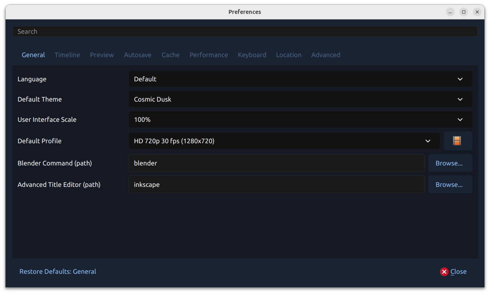
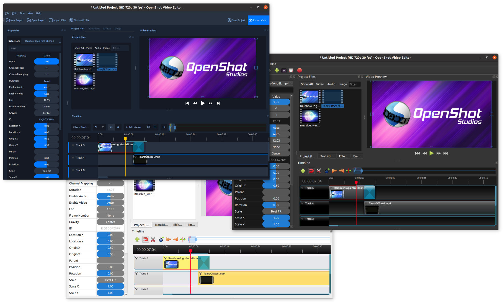
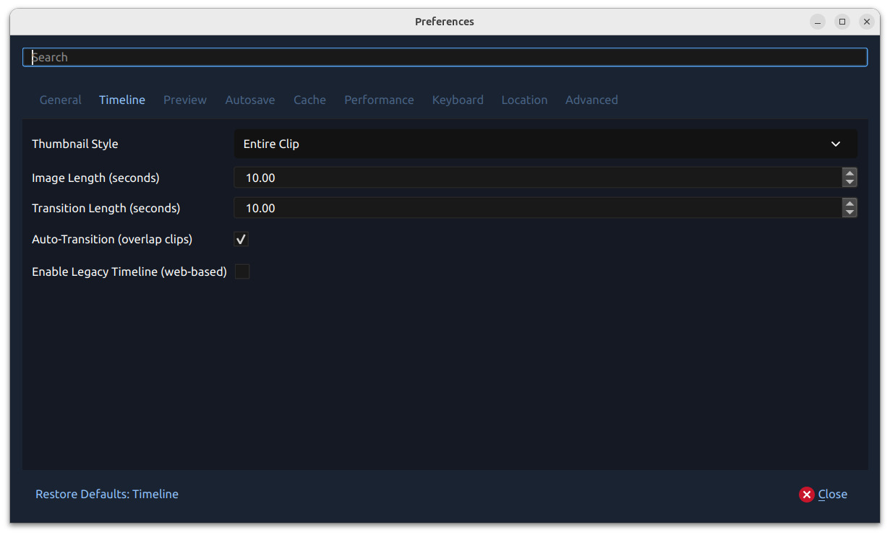
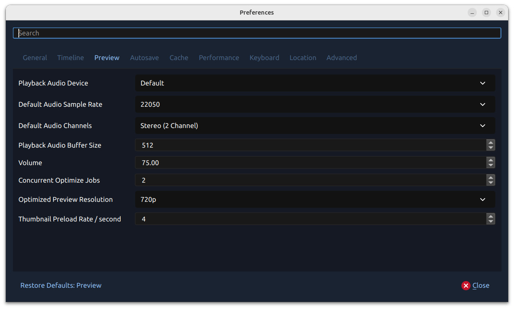
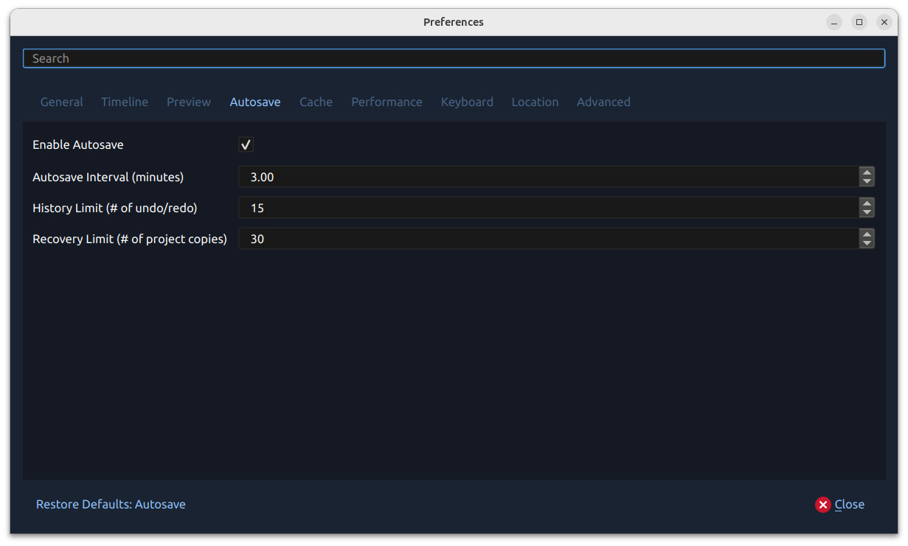
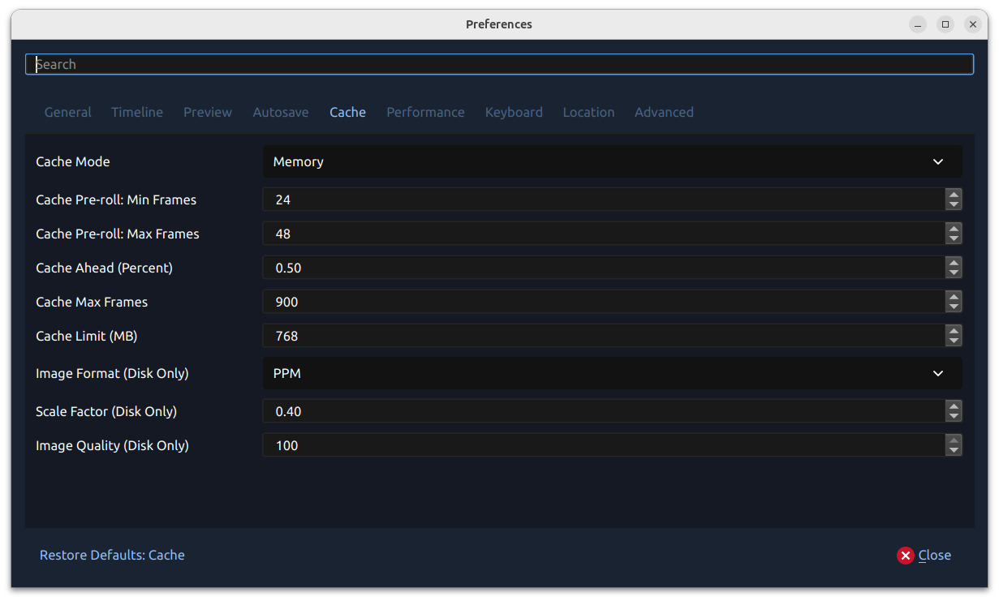
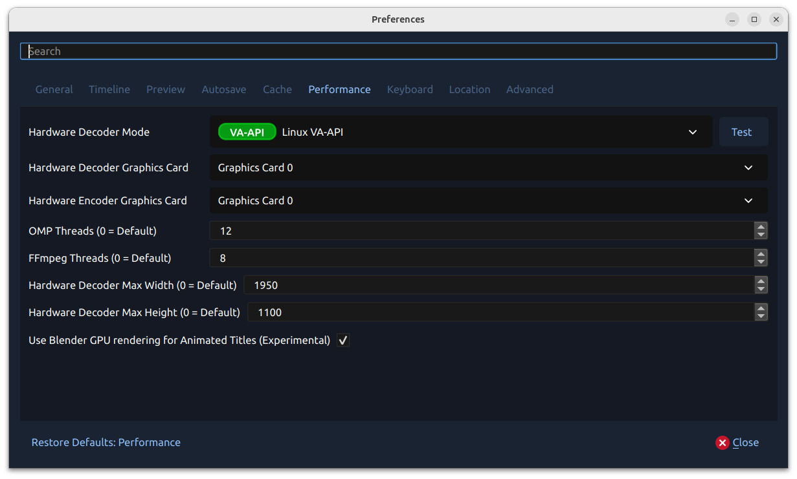
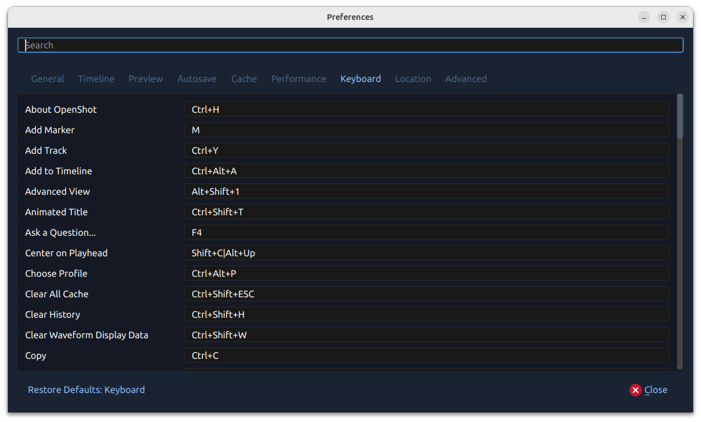
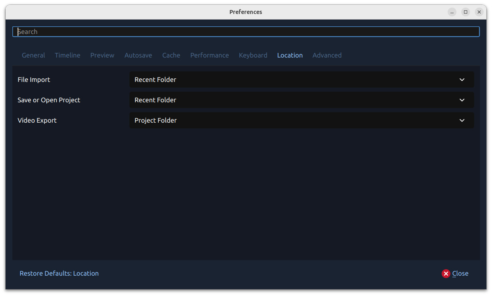
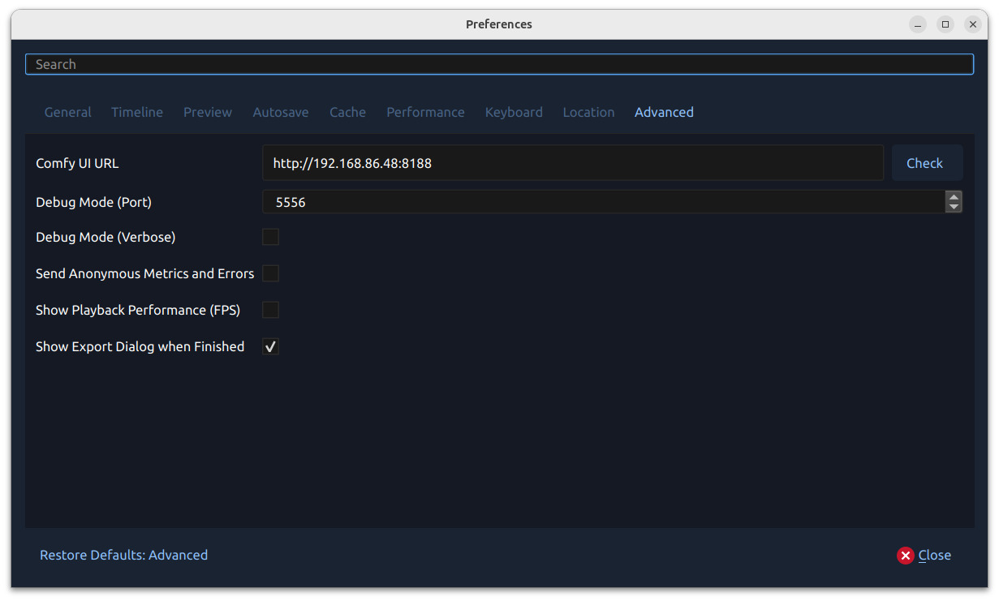

.. Copyright (c) 2008-2020 OpenShot Studios, LLC
 (http://www.openshotstudios.com). This file is part of
 OpenShot Video Editor (http://www.openshot.org), an open-source project
 dedicated to delivering high quality video editing and animation solutions
 to the world.

.. OpenShot Video Editor is free software: you can redistribute it and/or modify
 it under the terms of the GNU General Public License as published by
 the Free Software Foundation, either version 3 of the License, or
 (at your option) any later version.

.. OpenShot Video Editor is distributed in the hope that it will be useful,
 but WITHOUT ANY WARRANTY; without even the implied warranty of
 MERCHANTABILITY or FITNESS FOR A PARTICULAR PURPOSE.  See the
 GNU General Public License for more details.

.. You should have received a copy of the GNU General Public License
 along with OpenShot Library.  If not, see <http://www.gnu.org/licenses/>.

.. _preferences_ref:

Preferences
===========

The Preferences window contains many important settings and configuration options for OpenShot. They can be
found in the top menu under :guilabel:`Edit→Preferences`. Many settings will require OpenShot to be restarted after your
changes are applied.

NOTE: Some features such as `Animated Titles` and `external SVG editing` require setting the paths for **Blender** and
**Inkscape** under the General tab. And if you notice audio playback issues, such as audio drift, you may need to
adjust the audio settings under the Preview tab.

.. _preferences_general_ref:

General
-------

The General tab of the Preferences window allows you to modify the settings that apply to OpenShot as a whole.

.. list-table::
   :widths: 30 20 50
   :header-rows: 1

   * - Setting
     - Default
     - Description
   * - Language
     - Default
     - Choose your preferred language for OpenShot menus and windows
   * - Default Theme
     - Cosmic Dusk
     - Choose your theme for OpenShot
   * - User Interface Scale
     - 100%
     - Choose a preset UI scaling factor for larger or smaller interface elements
   * - Default Profile
     - HD 720p 30 fps
     - Select the default profile for new projects and exports
   * - Blender Command (path)
     - blender
     - The path to the binary for Blender (version 5.0+)
   * - Advanced Title Editor (path)
     - inkscape
     - The path to the binary for Inkscape

Themes
""""""
OpenShot comes with 3 standard themes, which change the look and feel of the program.

- **Cosmic Dusk:** [Default Theme] A bluish theme with a more modern UI design, enhancing the visual aesthetics of the editor. This theme features shades of blue and purple, giving the interface a contemporary and dynamic feel. It combines modern aesthetics with functionality, offering a fresh and visually appealing workspace for video editing.
- **Humanity Dark:** A dark theme with dark gray tones, providing a modern and sleek look. This theme is designed for users who prefer working in low-light conditions or who enjoy a more subdued and professional appearance. The dark gray background reduces glare and eye strain, making it suitable for extended editing sessions.
- **Retro:** A light theme that offers a classic and clean appearance. This theme uses light gray and white tones, making it ideal for users who prefer a bright and high-contrast interface. It provides a traditional look that is easy on the eyes, especially in well-lit environments.

Restoring Defaults
""""""""""""""""""
In OpenShot, each preferences category (or tab) in the Preferences window has a **Restore Defaults** button that allows
you to easily reset the values for that specific category. This feature is particularly useful if you want to
reset only certain parts of your preferences, like keyboard shortcuts, without affecting the rest of your custom settings.

**Where to Find the Restore Defaults Button:**
Each category or tab in the Preferences window has a **Restore Defaults** button located in the bottom left corner of the screen.
The name of the button updates based on the category you’re viewing. For example, if you're in the "Keyboard" tab,
the button will say **Restore Defaults: Keyboard**.

**How It Works:**
Only the settings in the currently selected category will be restored to their default values. This selective restoration makes it easy
to reset certain preferences without affecting others.

**Tip for Beginners:**
- If you're not sure about a change you've made in a particular category, don’t hesitate to use the **Restore Defaults** button. It’s a simple way to undo changes and get back to the default settings for that specific category without affecting your overall setup.

.. _preferences_timeline_ref:

Timeline
--------

The Timeline tab controls default timeline behavior, clip/transition insertion defaults, and whether
to use the new timeline backend or the legacy web-based timeline.

.. table::
   :widths: 30 15 60

   ===================================  ==================  ===========
   Setting                              Default             Description
   ===================================  ==================  ===========
   Thumbnail Style                      Entire Clip         Thumbnail density for the new timeline backend
   Image Length (seconds)               10.00               Default duration for still images added to the timeline
   Transition Length (seconds)          10.00               Default duration for newly added transitions
   Auto-Transition (overlap clips)      Enabled             Automatically create transitions when clips overlap
   Enable Legacy Timeline (web-based)   Disabled            Use the legacy web timeline (WebEngine/WebKit auto-select)
   ===================================  ==================  ===========

.. _preferences_preview_ref:

Preview
-------

The Preview tab of the Preferences window controls real-time preview audio behavior,
including device selection, sample rate, channels, buffering, playback volume, and optimized preview behavior.

.. table::
   :widths: 30 15 60

   ================================  ==================  ===========
   Setting                           Default             Description
   ================================  ==================  ===========
   Playback Audio Device             Default             Audio output device used during preview playback
   Default Audio Sample Rate         48000               Default preview sample rate
   Default Audio Channels            Stereo (2 Channel)  Default preview channel layout
   Playback Audio Buffer Size        512                 Audio samples buffered before playback begins (128 to 4096)
   Volume                            75                  Preview playback volume percentage
   Concurrent Optimize Jobs          2                   Number of video files OpenShot can optimize at the same time
   Optimized Preview Resolution      1280x720            Maximum resolution used when creating optimized preview files
   Thumbnail Preload Rate / second   4                   How many thumbnail preview frames per second are pre-generated while optimizing video
   ================================  ==================  ===========

Autosave
--------

Autosave is a feature in OpenShot which automatically saves the current changes to your project after
a specific number of minutes, helping to reduce the risk or impact of data loss in case of a crash, freeze
or user error.

.. table::
   :widths: 30 15

   =====================================  ==================
   Setting                                Default
   =====================================  ==================
   Enable Autosave                        Enabled
   Autosave Interval (minutes)            3
   History Limit (# of undo/redo)         15
   Recovery Limit (# of project copies)   30
   =====================================  ==================

Recovery
""""""""

**Before each save**, a compressed ``*.zip`` copy of the current project is saved in the recovery folder, to further
reduce the risk of data loss. The recovery folder is located at ``~/.openshot_qt/recovery/`` or
``C:\Users\USERNAME\.openshot_qt\recovery``.

To recover a corrupt or broken ``*.osp`` project file, use the :guilabel:`File->Recovery`
menu on the main window after opening your project. If available, a list of matching project versions from
the recovery folder are listed in chronological order (most recent one at the top). This will
automatically rename your current project file to ``{project-name}-{time}-backup.osp``, and
replace it with the recovery project file. You can repeat this process until you find
the correct recovery project. NOTE: If for some unexpected reason the recovery process fails, you can always rename
the "-backup.osp" file to the original project file name to restore it.

To **manually** recover a corrupt or broken ``*.osp``
project file, please find the most recent copy in the recovery folder, and copy/paste the file
into your original project folder location (i.e. the folder that contains your broken project).
If the recovery file has been zipped (``*.zip``), you must first extract the ``*.osp``, and then
copy it into your project folder. Recovery files are named ``{time}-{project-name}``. You can also use the
**Date Modified** on the file to select the version you are interested in recovering.

.. _preferences_cache_ref:

Cache
-----

Cache settings can be adjusted to make real-time playback faster or less CPU intensive. The cache is used
to store image and audio data for each frame of video requested. The more frames that are cached, the
smoother the real-time playback will be. However, the more that needs to be cached requires more
CPU to generate the cache. There is a balance, and the default settings provide a generally sane
set of cache values, which should allow most computers to playback video and audio smoothly. See :ref:`playback_ref`.

.. table::
   :widths: 36 80

   ================================  ==================
   Setting                           Description
   ================================  ==================
   Cache Mode                        Choose between Memory or Disk caching (memory caching is preferred). Disk caching writes image data to the hard disk for later retrieving, and works best with an SSD.
   Cache Limit (MB)                  How many MB are set aside for cache related data. Larger numbers are not always better, since it takes more CPU to generate more frames to fill the cache.
   Image Format (Disk Only)          Image format to store disk cache image data
   Scale Factor (Disk Only)          Percentage (0.1 to 1.0) to reduce the size of disk based image files stored in the disk cache. Smaller numbers make writing and reading cached image files faster.
   Image Quality (Disk Only)         Quality of the image files used in disk cache. The higher compression can cause more slowness, but results in smaller file sizes.
   Cache Pre-roll: Min Frames:       Minimum # of frames that must be cached before playback begins. The larger the #, the larger the wait before playback begins.
   Cache Pre-roll: Max Frames:       Maximum # of frames that can be cached during playback (in front of the playhead). The larger the #, the more CPU is required to cache ahead - vs display the already cached frames.
   Cache Ahead (Percent):            Between 0.0 and 1.0. This represents how much % we cache ahead of the playhead. For example, 0.5 would cache 50% behind and 50% ahead of the playhead. 0.8 would cache 20% behind and 80% ahead of the playhead.
   Cache Max Frames:                 This is an override on the total allowed frames that can be cached by our caching thread. It defaults to 900 frames, but even if you give a huge amount of RAM to OpenShot's cache size, this will override the max # of frames cached. The reason is... sometimes when the preview window is very small, and the cache size is set very high, OpenShot might calculate that we can cache 30,000 frames, or something silly which will take a huge amount of CPU, lagging the system. This setting is designed to clamp the upper limit of the cache to something reasonable... even on systems that give OpenShot huge amounts of RAM to work with.
   ================================  ==================

OpenShot's default cache settings now target a balanced preview experience:
roughly **50% behind / 50% ahead** of the playhead, **768 MB** cache memory,
and **900** max frames. In practice, this improves scrubbing and seek behavior
while reducing stale preview frames on slower systems.

Performance
-----------

Please keep in mind that GPU hardware acceleration is experimental at the moment. OpenShot supports both decoding and
encoding acceleration. For more information take a look at our `Github HW-ACCEL Doc <https://github.com/OpenShot/libopenshot/blob/develop/doc/HW-ACCEL.md>`_.
NOTE: On systems with older graphics cards, hardware acceleration may not always be faster than CPU encoding.

.. list-table::
   :widths: 36 80
   :header-rows: 1

   * - Setting
     - Description
   * - Hardware Decoder Mode
     - Select the hardware decoding backend to use. Use :guilabel:`Test` to verify the selected decoder mode.
   * - Hardware Decoder Graphics Card
     - Choose which GPU device is used for hardware decoding.
   * - Hardware Encoder Graphics Card
     - Choose which GPU device is used for hardware encoding.
   * - OMP Threads
     - Number of OpenMP worker threads used by performance-sensitive processing.
   * - FFmpeg Threads
     - Number of FFmpeg threads used for decoding/encoding.
   * - Hardware Decoder Max Width (0 = Default)
     - Optional maximum width for hardware decoding. Use ``0`` for no explicit limit.
   * - Hardware Decoder Max Height (0 = Default)
     - Optional maximum height for hardware decoding. Use ``0`` for no explicit limit.
   * - Use Blender GPU rendering for Animated Titles
     - Enable GPU rendering for Blender-based animated titles.

.. _preferences_keyboard_ref:

Keyboard
--------

This section allows you to view and customize hotkeys for various actions in the application.
Here, you can assign and manage multiple shortcuts for the same action and restore default shortcuts if needed.

- **Assign Multiple Shortcuts**:
  You can assign multiple keyboard shortcuts to the same action by separating them with a pipe (``|``) delimiter.
  This flexibility allows you to configure as many shortcuts as you need for each action.
- **Immediate Application**:
  No restart is required after adjusting keyboard shortcuts. Changes are applied immediately, so you can start using
  your updated shortcuts right away.
- **Restore Default Shortcuts**:
  If needed, you can reset all keyboard shortcuts to their default settings by clicking on the
  :guilabel:`Restore Defaults: Keyboard` button located in the bottom-left corner of the Preferences screen.
- **Unique Shortcuts**:
  Each keyboard shortcut must be unique. If there are any duplicate shortcuts, they will be highlighted in **red**
  and will not function until the conflict is resolved.

For more detailed information on how to use and customize keyboard shortcuts, see :ref:`keyboard_shortcut_ref`.

Location
--------

Default file path locations for saving/opening projects, importing files, and exporting videos can
be configured here. This can save you time by defaulting the open/save file dialogs to the most appropriate
starting folder (options described below).

.. table::
   :widths: 36 80

   ================================  ==================
   Setting                           Description
   ================================  ==================
   File Import                       Default folder to choose when importing a file
   Save or Open Project              Default folder to choose when saving or opening a project file
   Video Export                      Default folder to choose when exporting a video
   ================================  ==================

.. table::
   :widths: 25 80

   ================================  ==================
   Values                            Description
   ================================  ==================
   **Recent Folder**                 The last folder used for this same operation. Project folders, Import folders, and Export folders are tracked separately.
   **Project Folder**                The current project folder (or the user's home folder, if the project is not yet saved)
   ================================  ==================

.. _preferences_advanced_ref:

Advanced
--------

The Advanced tab includes ComfyUI integration and debugging options.

.. list-table::
   :widths: 30 20 50
   :header-rows: 1

   * - Setting
     - Default
     - Description
   * - Comfy UI URL
     - ``http://127.0.0.1:8188``
     - URL of your local or remote ComfyUI server
   * - Debug Mode (Port)
     - 5556
     - Port used by debug logging features
   * - Debug Mode (Verbose)
     - Disabled
     - Enable verbose debugging output
   * - Send Anonymous Metrics and Errors
     - Enabled
     - Send anonymous telemetry and error reports
   * - Show Playback Performance (FPS)
     - Disabled
     - Display live FPS in preview playback
   * - Show Export Dialog when Finished
     - Enabled
     - Display the Export Video window when export completes

The ComfyUI **Check** button updates an inline status icon: green checkmark for success, red icon for failure.
If OpenShot cannot reach this server, AI context menu options are hidden.
See :ref:`ai_ref` for setup details, requirements, and workflow options.

.. _preferences_reset_ref:

Reset (Default Values)
----------------------

To reset **all** preferences to their default values, please delete the ``openshot.settings`` file and
re-launch OpenShot. The settings file can be located at this path: ``~/.openshot_qt/openshot.settings`` or
``C:\Users\USERNAME\.openshot_qt\openshot.settings``. When OpenShot is re-launched, it will create the
missing ``openshot.settings`` file with default values.

Optionally, you can delete the entire ``.openshot_qt/`` folder and re-launch OpenShot. However, please make a
**backup** of any customized folders: **emojis, presets, profiles, recovery, title_templates, transitions,
or yolo**. For example, your ``/recovery/`` sub-folder contains backup copies of all your
existing projects (``*.osp`` files).

Deleting the ``.openshot_qt/`` folder is the quickest method to restore OpenShot preferences and settings
to their Default values (i.e. also called a `clean install`). When OpenShot is re-launched, it will create
any missing folders (i.e. ``.openshot_qt/``) and settings files. See our
`step-by-step guide <https://github.com/OpenShot/openshot-qt/wiki/Clean-Installation-of-OpenShot>`_ for more
information about **clean installs** of OpenShot.
