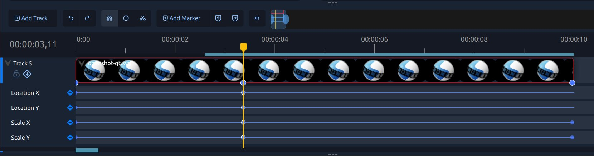

.. Copyright (c) 2008-2026 OpenShot Studios, LLC
 (http://www.openshotstudios.com). This file is part of
 OpenShot Video Editor (http://www.openshot.org), an open-source project
 dedicated to delivering high quality video editing and animation solutions
 to the world.

.. OpenShot Video Editor is free software: you can redistribute it and/or modify
 it under the terms of the GNU General Public License as published by
 the Free Software Foundation, either version 3 of the License, or
 (at your option) any later version.

.. OpenShot Video Editor is distributed in the hope that it will be useful,
 but WITHOUT ANY WARRANTY; without even the implied warranty of
 MERCHANTABILITY or FITNESS FOR A PARTICULAR PURPOSE.  See the
 GNU General Public License for more details.

.. You should have received a copy of the GNU General Public License
 along with OpenShot Library.  If not, see <http://www.gnu.org/licenses/>.

.. _timeline_ref:

Timeline
========

The timeline is where your video comes together. You arrange clips, trim them,
layer visuals, and make timing decisions here. If you are new to editing, think
of the timeline as a simple left-to-right story: earlier moments on the left,
later moments on the right.

If you are just getting started, read :ref:`quick_tutorial_ref` first, then come
back here for more detail.
For a labeled breakdown of toolbar controls, see :ref:`timeline_toolbar_ref`.

Timeline Basics
---------------

These terms are used often in this guide:

.. table::
   :widths: 20 80

   =============  ============
   Term           Meaning
   =============  ============
   Playhead       The red line that shows your current time position.
   Track          A horizontal layer that holds clips (top tracks appear above lower tracks).
   Clip           A video, audio, or image item placed on a track.
   Transition     A blend between two overlapping clips.
   Marker         A saved point in time you can jump back to quickly.
   Keyframe       A saved value at a point in time (used for animation).
   =============  ============

For a full glossary, see :ref:`glossary_ref`.

Common Timeline Tasks
---------------------

Most editing sessions follow a similar flow:

1. Add media to the project using :ref:`import_files_ref`.
2. Drag files from the project panel onto timeline tracks.
3. Trim clip edges to remove extra content.
4. Move clips into order and stack tracks to build your scene.
5. Add transitions and effects where needed (:ref:`transitions_ref`, :ref:`effects_ref`).
6. Preview and adjust timing (:ref:`playback_ref`).

Clip trimming, slicing, and clip context menu actions are covered in detail in :ref:`clips_ref`.

Selecting Clips and Transitions
-------------------------------

Selection is one of the most important timeline skills:

- Click an item to select it.
- :kbd:`Ctrl+Click` adds or removes items from selection.
- :kbd:`Shift+Click` selects a range between your anchor item and the clicked item.
- :kbd:`Ctrl+Shift+Click` adds that range to your current selection.
- :kbd:`Alt+Click` ripple-selects from the clicked item to the end of the track.
- Drag an empty-area selection box to select multiple items.

See :ref:`clips_ref` for the full list and examples.

Timeline Toolbar and Zoom
-------------------------

The timeline toolbar helps with common navigation and editing actions (snapping,
retime, razor, markers, centering, and zoom).

Tip: If timeline editing feels crowded, zoom in with the timeline slider to make
small clip adjustments easier.

You can also zoom the timeline with :kbd:`Ctrl+Scroll Wheel`. On the QWidget
timeline, hold :kbd:`Ctrl` and drag with the middle mouse button for smooth
zooming.

Tracks, Locking, and Inserting
------------------------------

Tracks help organize your edit. A common setup is:

- Top tracks: titles, overlays, logos, picture-in-picture
- Middle tracks: main video content
- Lower tracks: music and sound effects

You can lock tracks to protect them from accidental edits and use insert/ripple
editing when you need later clips to move automatically.

For track layout basics, see :ref:`tracks_ref`. For detailed clip editing behavior,
see :ref:`clips_cutting_slicing_ref`.

Keyframes in the Timeline
-------------------------

Keyframes let you change values over time, such as position, scale, rotation,
opacity, and effect settings.

In the timeline keyframe panel, each row represents one animated property. You can:

- Add a keyframe row for a property
- Insert new keyframes along the row
- Move keyframes to change timing
- Change interpolation to control motion style

For keyframe concepts and animation examples, see :ref:`animation_ref`.

Next Steps
----------

After you are comfortable with timeline basics, these sections are the best next reads:

- :ref:`clips_ref` for trimming, slicing, and clip properties
- :ref:`effects_ref` for video/audio effects
- :ref:`animation_ref` for keyframe animation workflows
- :doc:`export` for creating your final video file
